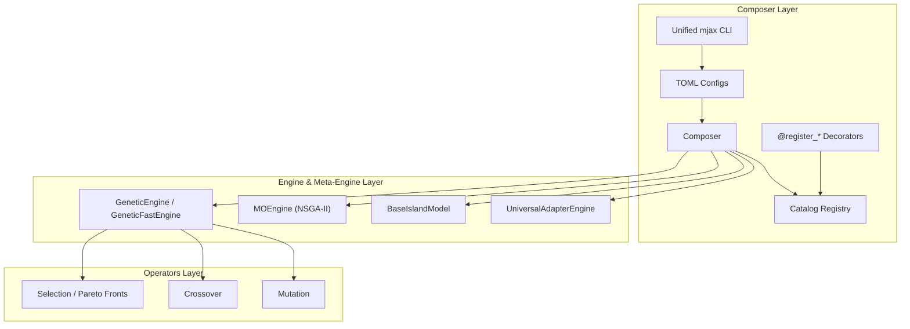

# MalthusJAX

[](https://github.com/google/jax)
[](https://github.com/astral-sh/ruff)
[](http://mypy-lang.org/)
[](https://leonardodicaterina.github.io/MalthusJAX/coverage/)
[](LICENSE)

**MalthusJAX is a JAX-native evolutionary computation framework designed around PyTree state, vectorized operators, preallocated PRNG resources, and `lax.scan`-compiled generational loops.**

Define your experiments declaratively in TOML files or Python APIs, and run multi-seed, hardware-accelerated pipelines with a single compiled XLA kernel.

*No Python loop overhead. No recompilation between generations. Just fast, scalable JAX state transitions.*

---

## ⚡ Quickstart

Get your first hardware-accelerated evolutionary pipeline running in under 10 lines of code:

```python
from malthusjax.composer import Composer

# Create default composer (automatically discovers registered operators)
composer = Composer.create_default()

# Run a fully compiled, multi-seed genetic algorithm on the GPU
result = composer.quick_run(
    fitness="sphere:dim=10",
    selection="tournament:num_selections=64,tournament_size=3",
    crossover="blend:alpha=0.5",
    mutation="gaussian:mutation_rate=0.1",
    pop_size=100,
    generations=200,
    seeds=(42, 43, 44),
)

# Print standard summary metrics
print(result.aggregated_summary())
```

---

## 🧅 Multi-Level API: Choose Your Abstraction

MalthusJAX is not just a high-level TOML orchestrator—it is a deeply modular toolkit. You can use it as a complete CLI application, or rip out individual vectorized operators to plug directly into your own custom JAX training loops.

### [Level 4: The Composer](src/malthusjax/composer/README.md) (Highest Abstraction)
- **What it is**: The `Composer` and `mjax` CLI.
- **Use case**: Declarative TOML experiments, dynamic string-based plugin resolution, statistical parity testing, and multi-seed sweeps.
- **Example**: `mjax run experiment.toml`

### [Level 3: The Engine](src/malthusjax/engine/README.md)
- **What it is**: `GeneticEngine`, `MOEngine`, `GeneticFastEngine`.
- **Use case**: You want full control over the `jax.lax.scan` loop (e.g., for custom logging or RL environment stepping), but you want MalthusJAX to handle the 5-phase generation logic.
- **Example**: `next_state = engine.step(state)`

### [Level 2: The Operators](src/malthusjax/operators/README.md)
- **What it is**: `BaseMutation`, `BaseCrossover`, `BaseSelection`.
- **Use case**: You already have a custom training loop and just want a blazing-fast, vectorized SBX crossover or Gaussian mutation function that runs on the GPU.
- **Example**: `new_population = mutation(population, rng_key)`

### [Level 1: Core State & Encodings](src/malthusjax/core/README.md) (Lowest Abstraction)
- **What it is**: `BasePopulation`, `RealGenome`, `BinaryGenome`.
- **Use case**: Pure `flax.struct` PyTrees designed for contiguous memory access and Struct-of-Arrays (SoA) layouts. Perfect if you are building an evolutionary algorithm completely from scratch.

---

## 🚀 Installation

```bash
# Clone the repository
git clone https://github.com/LeonardoDiCaterina/MalthusJAX.git
cd MalthusJAX

# Install in development mode with all dependencies
make install-dev
```
*Requires Python 3.8+ and JAX 0.4+.*

---

## ✨ Key Features

- **JIT-Compiled Engines**: Entire generation loops are fused into single JAX kernels executing synchronously on GPUs/TPUs.
- **Universal Composer API**: Dynamic Ask/Tell and compilation routing across EvoSAX, QDAX, and TensorNEAT under a single configuration layer.
- **Unified CLI (`mjax`)**: Clean separation of execution (`run`, `parity`), analysis (`analyze`), plotting (`plot`), and reports (`report`).
- **Zero-Boilerplate Plugins**: Use `@register_mutation`, `@register_engine`, etc., for seamless Jupyter Notebook and script integration.
- **Multi-Genome Encoding**: Native support for **Real-valued** (continuous), **Binary** (combinatorial), and **Categorical** (permutations) genomes.
- **Hardware-Accelerated RL**: Deep native integrations with **Gymnax**, **Brax**, and **Jumanji** to evolve neural network policies at millions of frames per second.
- **GPU-Native Island Models**: Zero-overhead distributed parallel populations with topological migration (`jnp.roll`) executing entirely in GPU VRAM.
- **Multi-Objective Optimization**: Vectorized Non-dominated Sorting Genetic Algorithm II (NSGA-II) math running inside the dedicated `MOEngine`.
- **Quality-Diversity Integration**: Native MAP-Elites grid mapping and vectorized behavioral descriptor emitters.

---

## 🧠 Architecture & "Why JAX?"

Evolutionary algorithms look embarrassingly parallel, but naive implementations repeatedly cross the Python/JAX boundary every generation, resulting in massive overhead.

MalthusJAX models an entire evolutionary generation as a **pure PyTree state transition**, compiling the *entire multi-generation loop* into a single XLA program using `jax.lax.scan`:

$$\text{State}_t \xrightarrow{\text{entropy + selection + reproduction + evaluation}} \text{State}_{t+1}$$



---

## 🛠️ Unified CLI Workflow

Describe your evolutionary runs in a simple TOML configuration, run them on a GPU server, and analyze/plot them locally:

```toml
# configs/experiment.toml
[experiment]
name = "crossover_comparison"
output_dir = "results/crossover_comparison"

[experiment.shared]
fitness       = "sphere:dim=10"
selection     = "tournament:num_selections=25"
mutation      = "gaussian:mutation_rate=0.1"
engine_type   = "ga"
pop_size      = 50
generations   = 100

[pipelines.blend_ga]
crossover = "blend:alpha=0.5"

[pipelines.sbx_ga]
crossover = "simulated_binary:eta=2.0"
```

Use the `mjax` CLI for execution and automated statistical analysis (Wilcoxon, TOST equivalence):

```bash
# 1. Run the experiment sweep across all pipelines and seeds
mjax run configs/experiment.toml

# 2. Analyze results with malthusjax.stats hypothesis testing
mjax analyze results/crossover_comparison

# 3. Generate convergence and distribution plots
mjax plot results/crossover_comparison
```

---

## 🔌 Advanced Integrations

MalthusJAX acts as a universal bridge, allowing you to natively compile and benchmark external libraries alongside MalthusJAX strategies.

### EvoSAX
```python
result = composer.quick_run(
    fitness="bbob:fn_name=sphere,dim=10",
    backend="evosax",                     # Use the EvoSAX backend!
    evosax_strategy="CMA_ES",             # Select any EvoSAX strategy
    pop_size=64, generations=100
)
```

### QDAX (Quality-Diversity)
MalthusJAX provides native adapter builders (e.g., `build_qdax_engine`) that translate MAP-Elites grids seamlessly into the unified `Engine` protocol, running on the GPU at maximum speed.

### TensorNEAT
Evolve complex neural network topologies natively on accelerators using our `build_tensorneat_engine` wrapper.

---

## 🤝 Contributing & Community

We are actively building a comprehensive "rack" of Genetic Operators and Evolutionary Engines (specifically targeting `evosax` parity and advanced domain extensions like Protein Folding and LSP optimization).

Please read our **[CONTRIBUTING.md](CONTRIBUTING.md)** for our Golden Rules (`jax.jit` / `flax.struct` compliance) and instructions on how to use the built-in **Scaffolding CLI** (`make scaffold`) to generate boilerplate code and tests instantly!

---

## 📊 Research, Benchmarks, & Validation

MalthusJAX was designed with rigorous empirical validation and statistical parity in mind. It has been validated on an **NVIDIA H100 GPU** over **72,000+ experimental runs** across 4 publication benchmark suites.

- **Optimization Quality Parity**: OLS treatment regression models and TOST equivalence tests support practical equivalence with EvoSAX ($p > 0.05$ across standard BBOB functions).
- **~2.14x Generation Speedup**: Fusing generation loops into pure JAX kernels executes in **18.9 ms** vs native EvoSAX's **40.6 ms** per run on H100.
- **Operator Ablation Proof**: Swapping individual genetic operators shows **$p_{\text{holm}} = 1.0$** across function timing regressions, demonstrating zero overhead in modular composition.
- **Rigorous Invariants**: Extensive `pytest` and `Hypothesis` suites guarantee PyTree shape purity, deterministic PRNG allocation, and execution parity between Python and `lax.scan` fused execution.

> 📖 **Architecture Deep Dive:** Read our [Show & Tell Showcase](docs/SHOWCASE.md) to explore the 5-layer design and empirical H100 scaling benchmarks!

---

## 🐳 Docker & Cluster Deployment

MalthusJAX includes a robust, multi-stage `Dockerfile` to simplify deployment on shared GPU clusters. The image allows you to cleanly isolate optional dependencies (`qdax`, `evosax`, `tensorneat`, `rl`) during the build process:

```bash
docker build \
  --build-arg BASE_IMAGE=nvidia/cuda:12.2.0-base-ubuntu22.04 \
  --build-arg EXTRAS="[cuda12,qdax,rl]" \
  -t malthusjax:latest .
```

---

## License

This project is licensed under the MIT License - see the [LICENSE](LICENSE) file for details.