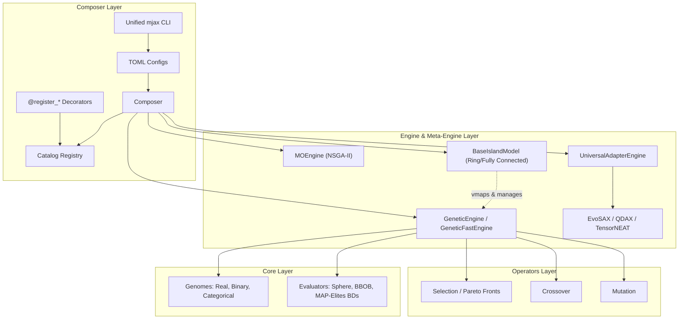

# MalthusJAX

[](https://github.com/google/jax)
[](https://github.com/astral-sh/ruff)
[](http://mypy-lang.org/)
[](https://github.com/LeonardoDiCaterina/MalthusJAX)
[](LICENSE)

**Evolve solutions at GPU speed.** MalthusJAX is a JAX-powered evolutionary computation framework. Define your experiments declaratively in TOML files, and run multi-seed, hardware-accelerated pipelines with a single command. 

*No boilerplate. No recompilation between generations. Just fast, scalable evolution.*

---

## Key Features

- **JIT-Compiled Engines**: Entire generation loops are fused into single JAX kernels executing on GPUs/TPUs.
- **Universal Composer API**: Dynamic Ask/Tell and compilation routing across EvoSAX, QDAX, and TensorNEAT under a single configuration layer.
- **Unified CLI (`mjax`)**: Clean separation of execution (`run`, `parity`), analysis (`analyze`), plotting (`plot`), and reports (`report`).
- **Decorators for Custom Extensions**: Zero-boilerplate registry decorators (`@register_selection`, `@register_mutation`, etc.) for seamless Jupyter Notebook and script integration.
- **Multi-Genome Encoding**: Native support for **Real-valued** (continuous), **Binary** (combinatorial), and **Categorical** (permutations) genomes.
- **GPU-Native Island Models**: Zero-overhead distributed parallel populations with topological migration (`jnp.roll`) executing entirely in GPU VRAM.
- **Multi-Objective Optimization**: Vectorized Non-dominated Sorting Genetic Algorithm II (NSGA-II) math running inside the dedicated `MOEngine`.
- **Quality-Diversity Integration**: Native MAP-Elites grid mapping and vectorized behavioral descriptor emitters.
- **Hardware-Accelerated RL**: Deep native integrations with **Gymnax**, **Brax**, and **Jumanji** to evolve neural network policies at millions of frames per second.
- **Statistical Parity Suite**: Direct seed-aligned comparison with [evosax](https://github.com/RobertTLange/evosax) including automatic hypothesis testing (t-test, Wilcoxon, sign test).
- **Ask/Tell Interface**: Standard stateful API for custom external evaluation loops (e.g. physics simulations or API-bound calls).

---

## Architecture

MalthusJAX is structured hierarchically. The high-level Composer coordinates execution, dynamically spawning fast engines or external adapters, while keeping memory vectorization unified.



---

## Installation

```bash
# Clone the repository
git clone https://github.com/LeonardoDiCaterina/MalthusJAX.git
cd MalthusJAX

# Install in development mode with all dependencies
make install-dev
```

*Python 3.8+ and JAX 0.4+ required.*

---

## Docker & Cluster Usage

MalthusJAX includes a robust, multi-stage `Dockerfile` to simplify deployment on shared GPU clusters. The image allows you to cleanly isolate optional dependencies (`qdax`, `evosax`, `tensorneat`, `kozax`, `rl`) during the build process using the `EXTRAS` argument.

```bash
# Example: Build an image containing only RL environments and QDAX
docker build \
  --build-arg BASE_IMAGE=nvidia/cuda:12.2.0-base-ubuntu22.04 \
  --build-arg EXTRAS="[cuda12,qdax,rl]" \
  -t malthusjax:latest .
```

### JAX Memory Management on Shared GPUs
By default, JAX aggressively pre-allocates 90% of available GPU VRAM. When running your Docker container on a shared cluster, this behavior can cause Out-Of-Memory (OOM) errors for others or block your container from starting.

To prevent this, override the default allocator at runtime:
```bash
docker run --gpus all \
  -e XLA_PYTHON_CLIENT_PREALLOCATE=false \
  -e XLA_PYTHON_CLIENT_ALLOCATOR=platform \
  -v $(pwd)/results:/app/results \
  malthusjax:latest run configs/experiment.toml
```

---

## Quick Start (CLI & TOML)

Describe your evolutionary runs in a simple TOML configuration:

```toml
# configs/examples/composer/experiment.toml
[experiment]
name = "crossover_comparison"
output_dir = "results/crossover_comparison"

[experiment.shared]
fitness       = "sphere:dim=10"
selection     = "tournament:num_selections=25,tournament_size=3"
mutation      = "gaussian:mutation_rate=0.1"
engine_type   = "ga"
pop_size      = 50
generations   = 100
genome_length = 10
bounds        = [-5.0, 5.0]
seeds         = [42, 43, 44]

[pipelines.blend_ga]
backend   = "malthusjax"
crossover = "blend:alpha=0.5"

[pipelines.sbx_ga]
backend   = "malthusjax"
crossover = "simulated_binary:eta=2.0"
```

Then run, analyze, and plot the results using the `mjax` CLI:

```bash
# 1. Run the experiment sweep across all pipelines and seeds
mjax run configs/examples/composer/experiment.toml

# 2. Analyze the raw metrics and export statistical tables
mjax analyze results/crossover_comparison

# 3. Generate convergence and performance plots
mjax plot results/crossover_comparison
```

The execution produces a structured results folder:
```text
results/crossover_comparison/
├── metadata/
│   └── config_snapshot.toml       # Snapshot of the experiment setup
├── data/
│   ├── pipeline_blend_ga/         # Raw seed metrics
│   │   ├── seed_42.json
│   │   └── ...
│   └── pipeline_sbx_ga/
└── analysis/
│   └── blend_ga_summary.json      # Aggregated mean/std metrics
└── plots/
    └── convergence.png            # Convergence overlay plot
```

---

## Unified CLI Command Reference

The `mjax` CLI provides an clean, offline-friendly workflow to run simulations on a GPU server, export results, and analyze/plot them locally:

| Command | Arguments | Description |
| :--- | :--- | :--- |
| `mjax run` | `<config_path>` | Runs the specified TOML experiment sweep. |
| `mjax parity` | `<config_path>` | Runs a seed-aligned parity execution (enforcing shared initial populations). |
| `mjax analyze` | `<results_dir>` | Computes summary statistics or statistical parity comparisons. |
| `mjax plot` | `<results_dir>` | Generates diagnostic and convergence plots. |
| `mjax report` | `<results_dir>` | Automatically chains `analyze` and `plot` together. |
| `mjax catalog` | — | Lists all registered framework operators. |

---

## Quick Experiment in Python

You can also run experiments directly in Python:

```python
from malthusjax.composer import Composer

# Create default composer
composer = Composer.create_default()

# Run a quick single-pipeline experiment
result = composer.quick_run(
    fitness="sphere:dim=10",
    selection="tournament:num_selections=64,tournament_size=3",
    crossover="blend:alpha=0.5",
    mutation="gaussian:mutation_rate=0.1",
    pop_size=100,
    generations=200,
    seeds=(42, 43, 44),
)

# Print metrics summary
print(result.aggregated_summary())
```

### Comparing Algorithms Side-by-Side

```python
comparison = composer.compare(
    pipelines={
        "Blend + Gaussian": dict(
            crossover="blend:alpha=0.5",
            mutation="gaussian:mutation_rate=0.1",
        ),
        "SBX + Polynomial": dict(
            crossover="simulated_binary:eta=2.0",
            mutation="polynomial:mutation_rate=0.1",
        ),
    },
    fitness="sphere:dim=10",
    pop_size=50,
    generations=100,
    seeds=(42, 43),
)

# Output LaTeX or Markdown summary tables
print(comparison.summary_table())
```

### Integrating External Libraries (EvoSAX & QDAX)

MalthusJAX's Composer allows you to effortlessly benchmark external libraries like **EvoSAX** against native MalthusJAX strategies in a single unified script:

```python
from malthusjax.composer import Composer

composer = Composer.create_default()

result = composer.quick_run(
    fitness="bbob:fn_name=sphere,dim=10",
    backend="evosax",                     # Use the EvoSAX backend!
    evosax_strategy="CMA_ES",             # Select any EvoSAX strategy
    pop_size=64,
    generations=100,
    seeds=(42, 43)
)

print(result.aggregated_summary())
```

For advanced Quality-Diversity experiments, MalthusJAX provides native adapter builder functions (e.g., `build_qdax_engine`) that translate MAP-Elites grids seamlessly into the unified `Engine` protocol:

```python
import jax
import jax.numpy as jnp
import functools
from qdax.core.map_elites import MAPElites
from qdax.core.emitters.standard_emitters import MixingEmitter
from qdax.utils.metrics import default_qd_metrics
from qdax.core.containers.mapelites_repertoire import compute_cvt_centroids
from malthusjax.composer.qdax_adapter import build_qdax_engine

# We wrap it in a mock object since build_qdax_engine looks for .scoring_function
class NativeEvaluator:
    def scoring_function(self, genotypes, random_key):
        # Sphere function negated for maximization
        fitnesses = -jnp.sum(jnp.square(genotypes), axis=-1)
        # Map the first two dimensions of the genotype into the [0, 1] range as descriptors
        descriptors = jnp.clip(genotypes[:, :2] / 10.0 + 0.5, 0.0, 1.0)
        return fitnesses, descriptors, {}

# 1. Prepare QDAX Centroids and Emitters
centroids = compute_cvt_centroids(
    num_descriptors=2, num_init_cvt_samples=10000, 
    num_centroids=100, minval=0.0, maxval=1.0, key=jax.random.PRNGKey(0)
)

emitter = MixingEmitter(
    mutation_fn=lambda x, key: x + jax.random.normal(key, x.shape) * 0.1,
    variation_fn=lambda x1, x2, key: x1,
    variation_percentage=0.5,
    batch_size=50
)

# 2. Wrap them directly into a MalthusJAX engine
engine = build_qdax_engine(
    strategy_cls=MAPElites,
    emitter=emitter,
    metrics_function=functools.partial(default_qd_metrics, qd_offset=0.0),
    evaluator=NativeEvaluator(),
    eval_mode="native",
    init_variables=jnp.ones((50, 10)) * 5.0,
    centroids=centroids,
    pop_size=50,
    generations=100,
    history_metrics=["qd_score", "coverage"]
)

# 3. Run on the GPU at maximum speed
results = engine.run_once(jax.random.PRNGKey(42))
print(f"Final QD Score: {results['history'][-1]['qd_score']:.2f}")
print(f"Final Coverage: {results['history'][-1]['coverage']:.2f}")
```
---

## Extending MalthusJAX with Decorators

MalthusJAX provides registry decorators so you can define and register custom operators, engines, or evaluators directly in Jupyter Notebooks or scripts. Registered components are immediately accessible via string specs in TOML configurations and Python APIs.

*Note: Decorators default to `override=True` to allow safe, repeated cell execution in notebooks.*

```python
from malthusjax.composer import register_mutation, register_fitness, Composer
import jax

# 1. Register a custom mutation operator
@register_mutation("my_offset_mutation")
def custom_mutation(genome, rng_key, strength=0.1, **kwargs):
    noise = jax.random.normal(rng_key, shape=genome.values.shape) * strength
    return genome.replace(values=genome.values + noise)

# 2. Register a custom fitness evaluator
@register_fitness("my_custom_sphere")
def custom_sphere(values, **kwargs):
    return jax.numpy.sum(jax.numpy.square(values))

# 3. Launch using your custom components instantly!
composer = Composer.create_default()
result = composer.quick_run(
    fitness="my_custom_sphere",
    mutation="my_offset_mutation:strength=0.2",
    crossover="blend:alpha=0.5",
    selection="elite_pool:num_selections=10",
    pop_size=32,
    generations=50,
    seeds=(42,),
)
```

Available decorators:
- `@register_selection(name="...")`
- `@register_crossover(name="...")`
- `@register_mutation(name="...")`
- `@register_fitness(name="...")`
- `@register_engine(name="...")`
- `@register_genome(name="...")`

---

## Beyond Continuous Optimization: Multi-Genome Support

MalthusJAX lets you select the encoding best suited for your problem:

| Genome Type | Encoding | Use Cases | Operator Catalog |
| :--- | :--- | :--- | :--- |
| `real` | Continuous values in `[bounds]` | Continuous optimization | Gaussian/Polynomial Mutation, Blend/SBX Crossover |
| `binary` | Bit strings (`0` / `1`) | Combinatorial selections | Bit-flip Mutation, Uniform/Single-Point Crossover |
| `categorical` | Integer permutations | Sequence / Ordering | Swap/Scramble Mutation, Order-preserving Crossover |

### Combinatorial Optimization Example (0/1 Knapsack)

```python
from malthusjax.core.fitness.binary_evaluators import KnapsackEvaluator
from malthusjax.core.genome.binary_genome import BinaryGenomeConfig
from malthusjax.operators.selection import ElitePoolSelection
from malthusjax.operators.crossover import UniformCrossover
from malthusjax.operators.mutation import BitFlipMutation
from malthusjax.engine import GeneticEngine, GeneticEngineParams
import jax.random as jar

# Create a random knapsack problem with synthetic weights and values
evaluator = KnapsackEvaluator.create_synthetic(
    n_items=20, capacity_ratio=0.5, seed=42, maximize=True
)

# Set up binary engine configuration
engine = GeneticEngine(
    engine_params=GeneticEngineParams(pop_size=64, elitism=2, num_generations=100),
    genome_config=BinaryGenomeConfig(length=20),
    evaluator=evaluator,
    selection=ElitePoolSelection(num_selections=32, elite_k=2),
    crossover=UniformCrossover(num_offspring=2),
    mutation=BitFlipMutation(mutation_rate=0.05),
)

# Run optimization on GPU
state = engine.init_state(rng_key=jar.PRNGKey(42))
final_state, history, elapsed = engine.run(state, time_it=True)
print(f"Best value found: {final_state.best_fitness:.2f}")
```

---

## Hardware-Accelerated Reinforcement Learning

MalthusJAX natively bridges to state-of-the-art JAX physics and RL environments, allowing you to unroll entire generations of Neural Network policies directly on accelerators:

- **Gymnax**: Evolve policies for classic control and standard benchmark tasks (e.g., CartPole).
- **Brax**: Evolve continuous control policies for complex MuJoCo-style robotics and locomotion tasks (e.g., Ant).
- **Jumanji**: Evolve algorithmic solutions for dynamic grid and combinatorial puzzles (e.g., Snake).

### RL Policy Evaluation Example

```python
from malthusjax.core.fitness.rl.gymnax_evaluator import GymnaxEvaluator, GymnaxEvaluatorConfig
from malthusjax.engine.genetic_fastengine import GeneticFastEngine, GeneticEngineConfig
import jax

# Initialize Gymnax CartPole (evaluating robustly over 10 random environments)
config = GymnaxEvaluatorConfig(env_name="CartPole-v1", max_steps=500, num_eval_envs=10)
evaluator = GymnaxEvaluator.create(config)

# MalthusJAX seamlessly maps your 1D Genome arrays into deep Flax PyTrees!
engine_config = GeneticEngineConfig(
    pop_size=2000, 
    num_generations=50, 
    genome_size=4610,  # Size of the flattened Flax policy network
    crossover_rate=0.8,
    mutation_rate=0.1
)
engine = GeneticFastEngine.create(engine_config)

# Evolve the RL policy synchronously at GPU speeds
# Note: Requires writing a minimal standard loop or using the provided run methods.
```

---

## Multi-Objective Optimization (NSGA-II)

MalthusJAX implements a fully vectorized Non-dominated Sorting Genetic Algorithm II (NSGA-II) within the `MOEngine` to optimize multiple conflicting objectives without leaving the GPU.

```python
from malthusjax.engine.mo.mo_engine import MOEngine
from malthusjax.core.genome.real_genome import RealGenomeConfig
from malthusjax.operators.selection import TournamentSelection
from malthusjax.operators.crossover import RealUniformCrossover
from malthusjax.operators.mutation import RealGaussianMutation
from malthusjax.core.fitness.mo.evaluator import BaseMOEvaluator

# Define config for 10-dimensional, 3-objective problem
genome_config = RealGenomeConfig(shape=(10,), bounds=(-5.0, 5.0))

engine = MOEngine(
    genome_config=genome_config,
    evaluator=MyMultiObjectiveEvaluator(),  # Returns (pop_size, 3) objectives
    selection=TournamentSelection(num_selections=100, tournament_size=3),
    crossover=RealUniformCrossover(num_offspring=1),
    mutation=RealGaussianMutation(mutation_rate=0.1),
)

# Compile and run the multi-objective loop
state = engine.init_state(jax.random.PRNGKey(42))
final_state, history, elapsed = engine.run(state, time_it=True)
```

---

## GPU-Native Distributed Island Models

To scale populations without communication bottlenecks, the `BaseIslandModel` allows you to parallelize optimization across isolated islands natively in VRAM using GPU vectorization (`jax.vmap`) and fast array shifts (`jnp.roll`).

```python
from malthusjax.engine.island_model.topologies import RingTopologyIsland
from malthusjax.engine import GeneticEngine, GeneticEngineParams

# Configure base engine running locally on a single island
base_engine = GeneticEngine(
    engine_params=GeneticEngineParams(pop_size=100),
    # ... selection, mutation, crossover, evaluator configs
)

# Wrap it in a 1,024-island ring topology
island_model = RingTopologyIsland(
    engine=base_engine,
    num_islands=1024,
    migration_interval=10,  # Migrate top individuals every 10 generations
    num_migrants=5,         # Number of elite migrants
)

# Run 100,000+ individuals in parallel fully on the GPU
state = island_model.init_state(jax.random.PRNGKey(42))
# Meta-engines are stepped using standard JAX loops or scan
final_state, _ = jax.lax.scan(
    lambda st, _: (island_model.step(st)[0], None),
    state, None, length=100
)
```

---

## Statistical Parity Benchmarking

To ensure implementation validity, MalthusJAX includes a dedicated statistical parity system that runs seed-aligned optimizations alongside `evosax` baseline implementations.

### Operator Equivalency Mapping

For apples-to-apples comparisons, map roles to their equivalents:

| Role | MalthusJAX Operator Spec | evosax Equivalence |
| :--- | :--- | :--- |
| **Selection** | `elite_pool` | `SimpleGA` built-in elite selection |
| **Crossover** | `evosax_uniform_crossover` | `SimpleGA` built-in uniform crossover |
| **Mutation** | `evosax_gaussian` | `SimpleGA` built-in Gaussian mutation |

### Running Statistical Parity Verification

```bash
# Execute parity using seed-aligned initial populations
mjax parity configs/parity/toy_gap_parity.toml

# Analyze parity statistics (compares distributions, runs Wilcoxon/t-tests)
mjax analyze results/toy_gap_parity
```

---

## Ask/Tell API for Custom Loops

For loops requiring evaluations outside of JAX (such as physics simulators, third-party APIs, or human-in-the-loop steps):

```python
# Initialize engine state
state = engine.init_state(rng_key)

for generation in range(generations):
    # 1. Ask for the current population candidate proposals
    engine_with_entropy, population = engine.ask(state)
    
    # 2. Evaluate fitness using external CPU/API simulators
    fitness_values = my_external_simulator(population.values)
    
    # 3. Tell the engine the evaluated fitness results
    state = engine_with_entropy.tell(state, population.replace(fitness=fitness_values))

print(f"Optimal fitness found: {state.best_fitness:.6f}")
```

---

## Development & Advanced Makefile Usage

MalthusJAX uses a comprehensive `Makefile` to manage everything from local development checks to massive GPU cluster benchmarks. 

### Local Checks and Tests
```bash
make check-all          # Format, lint, typecheck, and run full test suite (>=80% coverage)
make test-fast          # Run full suite, skip coverage (faster iteration)
make test-failing       # Re-run only the tests known to fail on multi-GPU hosts
make test-bench         # Run functional benchmarks locally
make docs               # Build Sphinx HTML docs
```

### Experiment Execution via TOML
You can run complex TOML experiments directly through the Makefile, including background execution (`nohup`) for long-running cluster jobs:
```bash
make run-toml TOML=configs/examples/experiment.toml
make run-toml-nohup TOML=configs/examples/experiment.toml  # Runs in background, logs to file
make suite-parity CONFIG_DIR=configs/thesis/ OUT_DIR=results/my_suite
```

### Thesis Benchmarking Pipeline
For research and ablation studies, MalthusJAX provides pre-configured benchmark pipelines (H1 Parity, H2 Ablation, H3 Representation):
```bash
make smoke-all          # Runs ultra-fast local smoke tests for all 3 hypothesis suites
make run-hard-all       # Executes the full hard-benchmark suite (GPU cluster recommended)
```
*(Append `-nohup` to any benchmark target to run it headlessly.)*

---

## License

This project is licensed under the MIT License - see the [LICENSE](LICENSE) file for details.