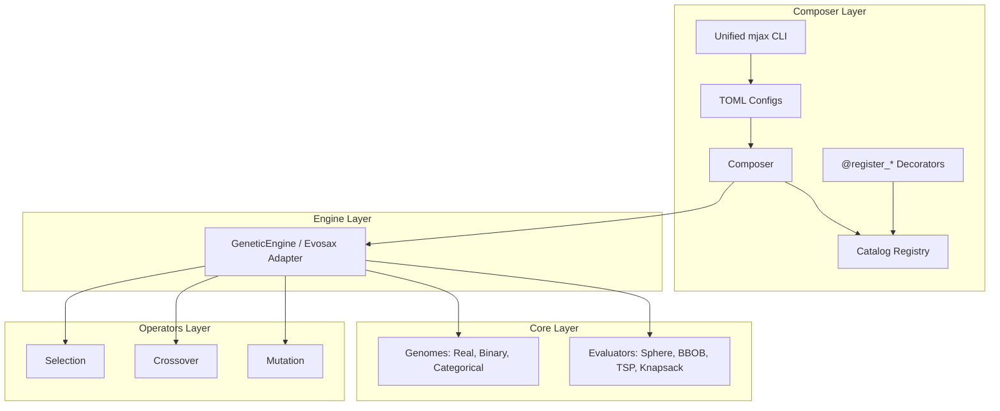

# MalthusJAX

[](https://github.com/google/jax)
[](https://github.com/astral-sh/ruff)
[](http://mypy-lang.org/)
[](https://github.com/LeonardoDiCaterina/MalthusJAX)
[](LICENSE)

**Evolve solutions at GPU speed.** MalthusJAX is a JAX-powered evolutionary computation framework. Define your experiments declaratively in TOML files, and run multi-seed, hardware-accelerated pipelines with a single command. 

*No boilerplate. No recompilation between generations. Just fast, scalable evolution.*

---

## Key Features

- **JIT-Compiled Engines**: Entire generation loops are fused into single JAX kernels executing on GPUs/TPUs.
- **Unified CLI (`mjax`)**: Clean separation of execution (`run`, `parity`), analysis (`analyze`), plotting (`plot`), and reports (`report`).
- **Decorators for Custom Extensions**: Zero-boilerplate registry decorators (`@register_selection`, `@register_mutation`, etc.) for seamless Jupyter Notebook and script integration.
- **Multi-Genome Encoding**: Native support for **Real-valued** (continuous), **Binary** (combinatorial), and **Categorical** (permutations) genomes.
- **Statistical Parity Suite**: Direct seed-aligned comparison with [evosax](https://github.com/RobertTLange/evosax) including automatic hypothesis testing (t-test, Wilcoxon, sign test).
- **Ask/Tell Interface**: Standard stateful API for custom external evaluation loops (e.g. physics simulations or API-bound calls).

---

## Architecture

MalthusJAX is structured hierarchically. Higher levels consume lower levels via a registry catalog.



---

## Installation

```bash
# Clone the repository
git clone https://github.com/LeonardoDiCaterina/MalthusJAX.git
cd MalthusJAX

# Install in development mode with all dependencies
make install-dev
```

*Python 3.8+ and JAX 0.4+ required.*

---

## Quick Start (CLI & TOML)

Describe your evolutionary runs in a simple TOML configuration:

```toml
# configs/examples/composer/experiment.toml
[experiment]
name = "crossover_comparison"
output_dir = "results/crossover_comparison"

[experiment.shared]
fitness       = "sphere:dim=10"
selection     = "tournament:num_selections=25,tournament_size=3"
mutation      = "gaussian:mutation_rate=0.1"
engine_type   = "ga"
pop_size      = 50
generations   = 100
genome_length = 10
bounds        = [-5.0, 5.0]
seeds         = [42, 43, 44]

[pipelines.blend_ga]
backend   = "malthusjax"
crossover = "blend:alpha=0.5"

[pipelines.sbx_ga]
backend   = "malthusjax"
crossover = "simulated_binary:eta=2.0"
```

Then run, analyze, and plot the results using the `mjax` CLI:

```bash
# 1. Run the experiment sweep across all pipelines and seeds
mjax run configs/examples/composer/experiment.toml

# 2. Analyze the raw metrics and export statistical tables
mjax analyze results/crossover_comparison

# 3. Generate convergence and performance plots
mjax plot results/crossover_comparison
```

The execution produces a structured results folder:
```text
results/crossover_comparison/
├── metadata/
│   └── config_snapshot.toml       # Snapshot of the experiment setup
├── data/
│   ├── pipeline_blend_ga/         # Raw seed metrics
│   │   ├── seed_42.json
│   │   └── ...
│   └── pipeline_sbx_ga/
└── analysis/
│   └── blend_ga_summary.json      # Aggregated mean/std metrics
└── plots/
    └── convergence.png            # Convergence overlay plot
```

---

## Unified CLI Command Reference

The `mjax` CLI provides an clean, offline-friendly workflow to run simulations on a GPU server, export results, and analyze/plot them locally:

| Command | Arguments | Description |
| :--- | :--- | :--- |
| `mjax run` | `<config_path>` | Runs the specified TOML experiment sweep. |
| `mjax parity` | `<config_path>` | Runs a seed-aligned parity execution (enforcing shared initial populations). |
| `mjax analyze` | `<results_dir>` | Computes summary statistics or statistical parity comparisons. |
| `mjax plot` | `<results_dir>` | Generates diagnostic and convergence plots. |
| `mjax report` | `<results_dir>` | Automatically chains `analyze` and `plot` together. |
| `mjax catalog` | — | Lists all registered framework operators. |

---

## Quick Experiment in Python

You can also run experiments directly in Python:

```python
from malthusjax.composer import Composer

# Create default composer
composer = Composer.create_default()

# Run a quick single-pipeline experiment
result = composer.quick_run(
    fitness="sphere:dim=10",
    selection="tournament:num_selections=64,tournament_size=3",
    crossover="blend:alpha=0.5",
    mutation="gaussian:mutation_rate=0.1",
    pop_size=100,
    generations=200,
    seeds=(42, 43, 44),
)

# Print metrics summary
print(result.aggregated_summary())
```

### Comparing Algorithms Side-by-Side

```python
comparison = composer.compare(
    pipelines={
        "Blend + Gaussian": dict(
            crossover="blend:alpha=0.5",
            mutation="gaussian:mutation_rate=0.1",
        ),
        "SBX + Polynomial": dict(
            crossover="simulated_binary:eta=2.0",
            mutation="polynomial:mutation_rate=0.1",
        ),
    },
    fitness="sphere:dim=10",
    pop_size=50,
    generations=100,
    seeds=(42, 43),
)

# Output LaTeX or Markdown summary tables
print(comparison.summary_table())
```

---

## Extending MalthusJAX with Decorators

MalthusJAX provides registry decorators so you can define and register custom operators, engines, or evaluators directly in Jupyter Notebooks or scripts. Registered components are immediately accessible via string specs in TOML configurations and Python APIs.

*Note: Decorators default to `override=True` to allow safe, repeated cell execution in notebooks.*

```python
from malthusjax.composer import register_mutation, register_fitness, Composer
import jax

# 1. Register a custom mutation operator
@register_mutation("my_offset_mutation")
def custom_mutation(genome, rng_key, strength=0.1, **kwargs):
    noise = jax.random.normal(rng_key, shape=genome.values.shape) * strength
    return genome.replace(values=genome.values + noise)

# 2. Register a custom fitness evaluator
@register_fitness("my_custom_sphere")
def custom_sphere(values, **kwargs):
    return jax.numpy.sum(jax.numpy.square(values))

# 3. Launch using your custom components instantly!
composer = Composer.create_default()
result = composer.quick_run(
    fitness="my_custom_sphere",
    mutation="my_offset_mutation:strength=0.2",
    crossover="blend:alpha=0.5",
    selection="elite_pool:num_selections=10",
    pop_size=32,
    generations=50,
    seeds=(42,),
)
```

Available decorators:
- `@register_selection(name="...")`
- `@register_crossover(name="...")`
- `@register_mutation(name="...")`
- `@register_fitness(name="...")`
- `@register_engine(name="...")`
- `@register_genome(name="...")`

---

## Beyond Continuous Optimization: Multi-Genome Support

MalthusJAX lets you select the encoding best suited for your problem:

| Genome Type | Encoding | Use Cases | Operator Catalog |
| :--- | :--- | :--- | :--- |
| `real` | Continuous values in `[bounds]` | Continuous optimization | Gaussian/Polynomial Mutation, Blend/SBX Crossover |
| `binary` | Bit strings (`0` / `1`) | Combinatorial selections | Bit-flip Mutation, Uniform/Single-Point Crossover |
| `categorical` | Integer permutations | Sequence / Ordering | Swap/Scramble Mutation, Order-preserving Crossover |

### Combinatorial Optimization Example (0/1 Knapsack)

```python
from malthusjax.core.fitness.binary_evaluators import KnapsackEvaluator
from malthusjax.core.genome.binary_genome import BinaryGenomeConfig
from malthusjax.operators.selection import ElitePoolSelection
from malthusjax.operators.crossover import UniformCrossover
from malthusjax.operators.mutation import BitFlipMutation
from malthusjax.engine import GeneticEngine, GeneticEngineParams
import jax.random as jar

# Create a random knapsack problem with synthetic weights and values
evaluator = KnapsackEvaluator.create_synthetic(
    n_items=20, capacity_ratio=0.5, seed=42, maximize=True
)

# Set up binary engine configuration
engine = GeneticEngine(
    engine_params=GeneticEngineParams(pop_size=64, elitism=2, num_generations=100),
    genome_config=BinaryGenomeConfig(length=20),
    evaluator=evaluator,
    selection=ElitePoolSelection(num_selections=32, elite_k=2),
    crossover=UniformCrossover(num_offspring=2),
    mutation=BitFlipMutation(mutation_rate=0.05),
)

# Run optimization on GPU
state = engine.init_state(rng_key=jar.PRNGKey(42))
final_state, history, elapsed = engine.run(state, time_it=True)
print(f"Best value found: {final_state.best_fitness:.2f}")
```

---

## Statistical Parity Benchmarking

To ensure implementation validity, MalthusJAX includes a dedicated statistical parity system that runs seed-aligned optimizations alongside `evosax` baseline implementations.

### Operator Equivalency Mapping

For apples-to-apples comparisons, map roles to their equivalents:

| Role | MalthusJAX Operator Spec | evosax Equivalence |
| :--- | :--- | :--- |
| **Selection** | `elite_pool` | `SimpleGA` built-in elite selection |
| **Crossover** | `evosax_uniform_crossover` | `SimpleGA` built-in uniform crossover |
| **Mutation** | `evosax_gaussian` | `SimpleGA` built-in Gaussian mutation |

### Running Statistical Parity Verification

```bash
# Execute parity using seed-aligned initial populations
mjax parity configs/parity/toy_gap_parity.toml

# Analyze parity statistics (compares distributions, runs Wilcoxon/t-tests)
mjax analyze results/toy_gap_parity
```

---

## Ask/Tell API for Custom Loops

For loops requiring evaluations outside of JAX (such as physics simulators, third-party APIs, or human-in-the-loop steps):

```python
# Initialize engine state
state = engine.init_state(rng_key)

for generation in range(generations):
    # 1. Ask for the current population candidate proposals
    engine_with_entropy, population = engine.ask(state)
    
    # 2. Evaluate fitness using external CPU/API simulators
    fitness_values = my_external_simulator(population.values)
    
    # 3. Tell the engine the evaluated fitness results
    state = engine_with_entropy.tell(state, population.replace(fitness=fitness_values))

print(f"Optimal fitness found: {state.best_fitness:.6f}")
```

---

## Development

Use the provided `Makefile` targets to lint, check types, format, and run tests:

```bash
make check-all    # Format, lint, typecheck, and test (enforces >=80% coverage)
make test         # Execute test suite
make lint         # Run Ruff formatting and linting
make docs         # Generate local Sphinx documentation
```

---

## License

This project is licensed under the MIT License - see the [LICENSE](LICENSE) file for details.