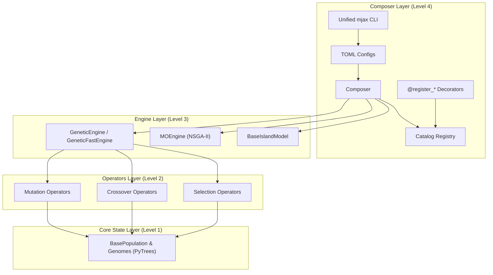

# MalthusJAX 🧬⚡

[](https://github.com/google/jax)
[](https://github.com/astral-sh/ruff)
[](http://mypy-lang.org/)
[](https://leonardodicaterina.github.io/MalthusJAX/coverage/)
[](LICENSE)

**From Raw JAX PyTrees to Declarative TOML Sweeps: A Multi-Level Evolutionary Framework.**

MalthusJAX is not just a high-level CLI tool for running experiments. It is a deeply modular, 4-tier evolutionary computation framework where every layer is designed to run synchronously on GPUs/TPUs using `jax.lax.scan`. 

Whether you want to declare a massive multi-seed parameter sweep via a TOML file, or you just want to rip out a blazingly fast, vectorized Simulated Binary Crossover (SBX) operator to plug into your own custom RL training loop, MalthusJAX scales to your exact level of abstraction.

*No Python loop overhead. No recompilation between generations. Just fast, scalable JAX state transitions.*

---

## 🧅 The Multi-Level API: Choose Your Abstraction

MalthusJAX is designed so you can enter the framework at the exact depth your project requires.

### [Level 4: The Composer](src/malthusjax/composer/README.md) (Highest Abstraction)
- **What it is**: The `Composer` API and the unified `mjax` CLI.
- **Use case**: You want to define declarative TOML experiments, resolve plugins dynamically, run statistical parity testing, and launch massive multi-seed sweeps without writing boilerplate.
- **Example**: `mjax run experiment.toml`

### [Level 3: The Engine](src/malthusjax/engine/README.md)
- **What it is**: Core evolutionary orchestration like `GeneticEngine` (aliased as `GeneticFastEngine`), `MOEngine`, `MapElitesEngine`, and `BaseIslandModel`.
- **Use case**: You want full control over the `jax.lax.scan` loop (e.g., to step custom RL environments or implement unique logging), but you want MalthusJAX to handle the 5-phase generation logic (Entropy → Selection → Crossover → Mutation → Evaluation).
- **Example**: `next_state, output = engine.step(state)`

### [Level 2: The Operators](src/malthusjax/operators/README.md)
- **What it is**: Pre-built, vectorized genetic operators (`BaseMutation`, `BaseCrossover`, `BaseSelection`).
- **Use case**: You already have a custom training loop built in JAX, and you simply need a highly optimized, GPU-accelerated crossover or mutation function to drop in.
- **Example**: `mutated_pop = mutation(keys, population, config)`

### [Level 1: The Core](src/malthusjax/core/README.md)
- **What it is**: Low-level foundational PyTrees (`BaseGenome`, `BasePopulation`, `malthusjax.core.random`) and the new 4-axis Composable Evaluator architecture (`Environment × Transform × Interpreter × Output`).
- **Use case**: You need deterministic PRNG key management, specialized genome representations (e.g., TensorNEAT graphs or bitstrings), or custom evaluation task composition.
- **Example**: `keys = malthusjax.core.random.split(key, 5)`

---

## ⚡ Quickstart (Level 4: The Composer)

Get your first hardware-accelerated evolutionary pipeline running on a GPU in under 10 lines of code using the Level 4 Python API:

```python
from malthusjax.composer import Composer

# Create default composer (automatically discovers registered operators)
composer = Composer.create_default()

# Run a fully compiled, multi-seed genetic algorithm on the GPU
result = composer.quick_run(
    fitness="sphere:dim=10",
    selection="tournament:num_selections=64,tournament_size=3",
    crossover="blend:alpha=0.5",
    mutation="gaussian:mutation_rate=0.1",
    pop_size=100,
    generations=200,
    seeds=(42, 43, 44),
)

# Print standard summary metrics
print(result.aggregated_summary())
```

---

## 🧠 Architecture & "Why JAX?"

Evolutionary algorithms look embarrassingly parallel, but naive implementations repeatedly cross the Python/JAX boundary every generation, resulting in massive host-to-device communication overhead.

MalthusJAX models an entire evolutionary generation as a **pure PyTree state transition**, compiling the *entire multi-generation loop* into a single XLA program using `jax.lax.scan`:

$$\text{State}_t \xrightarrow{\text{entropy + selection + reproduction + evaluation}} \text{State}_{t+1}$$



### 📊 H100 Benchmarks & Validation
MalthusJAX was designed with rigorous empirical validation and statistical parity in mind. It has been validated on an **NVIDIA H100 GPU** over **72,000+ experimental runs** across 4 publication benchmark suites.

- **~2.14x Generation Speedup**: Fusing generation loops into pure JAX kernels executes in **18.9 ms** vs native EvoSAX's **40.6 ms** per run on an H100.
- **Optimization Quality Parity**: TOST equivalence tests support practical equivalence with EvoSAX ($p > 0.05$ across standard BBOB functions).
- **Zero-Overhead Abstractions**: Swapping individual genetic operators shows $p_{\text{holm}} = 1.0$ across function timing regressions, demonstrating zero performance hit from our modular composition.

---

## 🛠️ The Ecosystem & Integrations

MalthusJAX is built to be extensible. You can write custom plugins (like a new mutation operator) and seamlessly integrate them into the ecosystem.

### The Scaffolding CLI & Standalone Compliance Suite
Writing custom operators in JAX can be tricky (e.g., getting the `vmap` axes and PyTree shapes exactly right). MalthusJAX provides a built-in scaffolding CLI that instantly generates boilerplate code for you:

```bash
python scripts/scaffold.py -t mutation -n QuantumMutation -k quantum_mutation
```
This generates your plugin *and* a `pytest` file that inherits from our **Standalone Compliance Suite**. The compliance suite automatically runs rigorous `jax.jit` and shape-contract tests on your plugin to ensure it will work flawlessly inside a complex MalthusJAX compiled loop. For complete usage across all 12 component types, see the [Extension CLI Guide](extension_cli_guide.md).

For declarative experiment definitions, multi-operator ablations, and automated benchmarking suites, see the [TOML Configuration Guide](toml_guide.md).

### External Library Integrations
MalthusJAX acts as a universal bridge, allowing you to natively compile and benchmark external libraries alongside MalthusJAX strategies:
- **EvoSAX:** Run any EvoSAX strategy natively through our `Composer`.
- **QDAX (Quality-Diversity):** Native adapter builders translate MAP-Elites grids into the unified Engine protocol.
- **TensorNEAT:** Evolve complex neural network topologies natively on accelerators.
- **Hardware-Accelerated RL:** Deep native integrations with **Gymnax**, **Brax**, and **Jumanji** to evolve neural network policies at millions of frames per second.

---

## 🚀 Installation & Deployment

### Local Installation
```bash
# Clone the repository
git clone https://github.com/LeonardoDiCaterina/MalthusJAX.git
cd MalthusJAX

# Install in development mode with all dependencies
make install-dev
```
*Requires Python 3.10+ and JAX 0.4+.*

### Docker Deployment
MalthusJAX includes a robust, multi-stage `Dockerfile` to simplify deployment on shared GPU clusters. Isolate optional dependencies (`qdax`, `evosax`, `tensorneat`, `rl`) during the build:

```bash
docker build \
  --build-arg BASE_IMAGE=nvidia/cuda:12.2.0-base-ubuntu22.04 \
  --build-arg EXTRAS="[cuda12,qdax,rl]" \
  -t malthusjax:latest .
```

---

## 🤝 Contributing

We are actively building a comprehensive "rack" of Genetic Operators and Evolutionary Engines! Please read our **[CONTRIBUTING.md](CONTRIBUTING.md)** for our Golden Rules (`jax.jit` / `flax.struct` compliance) and instructions on how to use the built-in **Scaffolding CLI**.

## License

This project is licensed under the MIT License - see the [LICENSE](LICENSE) file for details.