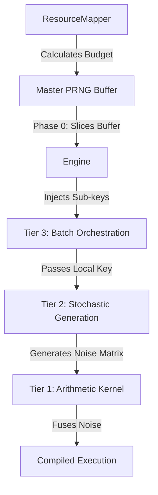
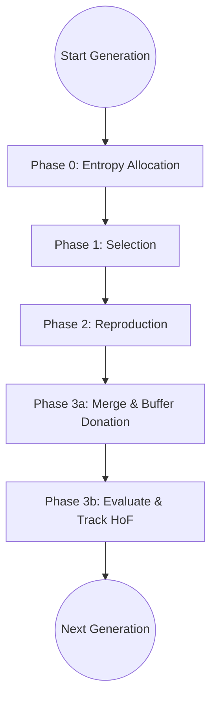

# Chapter 3: System Architecture and Software Engineering

## 3.1 Introduction
Developing a modern, hardware-accelerated evolutionary computation framework in JAX requires overcoming significant architectural hurdles. Traditional JAX frameworks often rely on flat tuples or dictionaries of arrays to maintain functional purity, resulting in sprawling codebases that are difficult to extend. Furthermore, the explicit management of Pseudo-Random Number Generator (PRNG) state and the requirement to aggressively fuse operations for the Accelerated Linear Algebra (XLA) compiler necessitate a radical rethinking of standard object-oriented design.

This chapter details the core software architecture of MalthusJAX, outlining the strict layered abstractions, the 3-Tier operator design, the declarative orchestration pipeline, and the modern software engineering practices that ensure its highly modular and scalable behavior.

## 3.2 The Data Layer: Object-Oriented State
MalthusJAX diverges from typical JAX paradigms by utilizing a strict, statically-typed object-oriented hierarchy built on `flax.struct.dataclass`. This enforces functional purity while maintaining developer ergonomics. At the heart of this data layer lies a philosophical separation of concerns: isolating the *mathematical logic of an individual* from the *batch orchestration of an ecosystem*.

This separation is codified into two intimately interacting, yet distinctly purposed, data structures:

- **`BaseGenome` (The Mathematical Atom):** Encapsulates the core mathematical representation and behavior of a *single individual*. Whether the search space is continuous (floats), combinatorial (binary bitstrings), or graph-based, the `BaseGenome` strictly defines the atomic, non-batched logic. It answers questions like: "How do I calculate the distance to another individual?" (`distance()`) or "How do I constrain myself if I exceed the search space?" (`autocorrect()`). It represents pure state manipulation for $N=1$.
- **`BasePopulation` (The Ecosystem Container):** A batched, Struct-of-Arrays (SoA) collection of genomes representing the entire evolutionary ecosystem for $N>1$. It acts as the unified state container, carrying both the raw parameter PyTree (`population.genes`) and all associated evolutionary tracking metadata, such as `fitness` arrays, `generation` counters, and boolean `is_elite` flags.

### 3.2.1 Agnostic Scaling via `jax.vmap` Delegation
The interaction between these two structures is governed by strict architectural delegation. The `BasePopulation` acts as a mathematically agnostic orchestrator; it has absolutely no knowledge of whether it is holding a `RealGenome` or a `CategoricalGenome`. 

When population-level operations are required, the `BasePopulation` does not implement the mathematical logic itself. Instead, it delegates the operation to the individual `BaseGenome` methods and scales them across the entire batch using JAX vectorization (`jax.vmap`). 

For example, when the engine must enforce domain boundaries across thousands of offspring, it calls `BasePopulation.autocorrect()`. Under the hood, the population simply applies `jax.vmap(BaseGenome.autocorrect)` over its internal data. This symbiotic relationship between Genome and Population guarantees that the core execution engine can route complex evolutionary pipelines over fundamentally distinct mathematical domains without changing a single line of the underlying loop. Developers only need to define how an individual genome behaves, and the population automatically scales it to the cluster level.

#### Practical Implications: Extensibility and Decoupling
This rigid separation of concerns unlocks profound practical advantages for future extensibility:
- **Genome Extensibility:** A researcher can effortlessly extend a `RealGenome` to represent an $N \times M$ matrix rather than a 1D vector, or to include custom diversity metric trackers directly inside the atom. Because the `RealPopulation` is agnostic, it will seamlessly load, track, and batch this new genome without any internal modifications. Any generic evolutionary operator or engine will treat this newly structured population exactly like a standard one.
- **Population Extensibility:** Conversely, if a researcher wishes to implement custom "macro-logic"—such as dynamic island-model migration or complex multi-objective Pareto front tracking—they can extend the `RealPopulation` directly. Because the population and genome are cleanly decoupled, modifying the macro-container does not require touching the underlying genome representation or atomic math functions.
- **Arbitrary Representations:** The architecture guarantees that fundamentally alien representations (e.g., Boolean networks or Symbolic Expression Trees) can be introduced natively. The researcher simply defines the new `BaseGenome` and `BasePopulation` pair. The Execution Engine layer sitting above remains 100% untouched. The only new code required to consume this representation is the specific Tier 1 Operators (e.g., a "Subtree Crossover" kernel) designed to act upon it.

## 3.3 The Evaluation Layer
Closely tied to the Data Layer is the `BaseEvaluator`, which bridges the abstract representation of a genome to a concrete fitness landscape. Following the framework's modular philosophy, the evaluation pipeline is cleanly decoupled into two distinct interception points:

1. **The Atomic Evaluation (`evaluate(genome) -> scalar`):** This is the fundamental, single-agent fitness logic. Developers focus strictly on "write scalar, execute parallel." When evaluating a generation, the orchestrator automatically applies `jax.vmap` over this method across the population's underlying PyTree.
2. **The Batch Orchestration (`evaluate_population(population) -> BasePopulation`):** This higher-level method controls the `jax.vmap` mapping and state injection. If a researcher needs to apply a *posterior transformation* across the entire evaluated batch—such as ranking fitnesses relative to the population, applying softmax normalization, or calculating shared fitness for speciation—they simply override this method. 

By keeping the atomic scalar evaluation decoupled from the batch tensor manipulation, the framework ensures that researchers do not have to mangle their core physics simulators or objective equations with complex batch normalizations.

#### Practical Implications: Zero-Overhead Simulator Integration
By strictly isolating the fitness logic from the batch dimension management, the `BaseEvaluator` dramatically lowers the barrier to entry for complex domain applications. 
- **Eliminating Tensor Gymnastics:** Researchers no longer need to write complex `jnp.einsum` operations or multi-dimensional matrix multiplications to evaluate a population. They simply write the standard logic to evaluate a single agent.
- **Complex Simulators:** If a researcher wishes to use MalthusJAX to evolve neural network weights for a Reinforcement Learning policy inside a physics simulator (e.g., Google Brax), they only need to define the single-agent rollout loop in the `evaluate` method. The framework automatically compiles and broadcasts that rollout across the entire population matrix in parallel.
- **Posterior Transformations:** Conversely, if the researcher is implementing a complex co-evolutionary algorithm where an individual's fitness depends on the performance of the rest of the population, they can seamlessly intercept the posterior fitness tensor at the `evaluate_population` level without breaking the atomic rollout logic.
- **BBOB Integration:** This architecture allowed the framework to easily integrate the entire Black-Box Optimization Benchmarking (BBOB) suite. The native BBOB scalar equations were implemented directly, and the framework automatically scaled them to evaluate highly dimensional search spaces ($D=500, P=16384$) instantly on the GPU.

## 3.4 The Operator Layer: 3-Tier Architecture
Developing evolutionary operators (crossover, mutation, selection) in standard JAX pipelines often leads to tangled "spaghetti code," where random key splitting, batch dimension tracking, and core mathematics are chaotically mixed. To maximize XLA compilation efficiency while enforcing highly modular and readable code, MalthusJAX's native operators (e.g., `BaseCrossover`, `BaseMutation`) are structurally designed around a strict 3-Tier separation of concerns:

1. **Tier 1 (The Arithmetic Kernel):** This is the pure mathematical core (`_mutate_one`, `_recombine_one`). It represents the fundamental biological or mathematical logic (e.g., adding Gaussian noise to a single float, or swapping specific bits between two parents). It receives raw tensors and pre-generated PRNG noise but does *not* handle random key splitting or batch orchestration. It is completely deterministic given the noise inputs.
2. **Tier 2 (Stochastic Generation):** JAX mandates explicit handling of pseudo-random state (`PRNGKey`). Tier 2 (`_generate_noise`) isolates all random key consumption. By separating PRNG generation from pure arithmetic, the XLA compiler can aggressively optimize and fuse random bit generation independently. MalthusJAX utilizes internal `_fused` wrappers to compile Tier 1 and Tier 2 into a single, highly optimized JIT-traced operation just before execution.
3. **Tier 3 (Batch Orchestration):** The outer shell (`__call__`). This layer takes the fused kernel and vectorizes it across the entire `BasePopulation` via nested `jax.vmap` calls. It acts as the structural manager, cleanly handling complex operations like `num_offspring` replication scaling, pair-major dimension flattening, and re-packing the raw `jnp.ndarray` outputs back into formal `BaseGenome` objects.

#### Practical Implications: Frictionless Operator Development
This 3-Tier design drastically lowers the friction of algorithm development. If a researcher wishes to invent a novel crossover mechanism, they *do not* need to understand JAX's complex batch dimension broadcasting or how to correctly split PRNG keys across a cluster. 

They only need to implement the **Tier 1 Arithmetic Kernel**, defining how exactly two parent vectors recombine to form a single offspring. The framework's Tier 2 will automatically generate the required entropy, and Tier 3 will automatically broadcast that scalar logic across hundreds of thousands of mating pairs on the GPU. This allows researchers to focus 100% of their cognitive load on the mathematical validity of their algorithm rather than infrastructural tensor management.

## 3.5 PRNG State Management: The Resource Mapper
Handling pseudo-random state explicitly is one of the most notorious challenges in JAX. Dynamic PRNG splitting (`jax.random.split`) inside compiled loops causes massive shape-tracing overhead and memory fragmentation. MalthusJAX solves this architectural bottleneck by combining the `ResourceMapper`—a mathematical allocation layer that runs *before* the engine compiles—with the strict 3-Tier Operator architecture.

The interaction between the global state and the localized operators flows as follows:

1. **Pre-Compilation Key Budgeting:** Before the evolutionary loop is ever compiled, the `ResourceMapper` polls every instantiated operator in the pipeline. It calls a deterministic method on the operator (e.g., `operator.num_keys(input_shape)`) to calculate the exact number of atomic random keys required for a single generation, based on the population size and `num_offspring` replication ratios.
2. **Master Buffer Pre-Allocation:** Instead of dynamically splitting keys sequentially during execution, the mapper pre-allocates a single, flat master buffer of keys for the entire evolutionary step.
3. **Execution Handoff (Tier 3 Injection):** During Phase 0 of the engine loop, the engine slices this master buffer into specific localized chunks. It injects these targeted sub-keys directly into the Batch Orchestration layer (Tier 3) of the corresponding operator.
4. **Stochastic Consumption (Tier 2 Isolation):** The operator's Tier 3 layer passes this localized key down to its Stochastic Generation layer (Tier 2). Here, the operator consumes the key to generate its specific noise matrices (e.g., a matrix of Gaussian floats or uniform crossover masks) which are then fused directly into the Tier 1 Arithmetic Kernel.

### 3.5.1 Strict Algorithmic Decoupling (Future-Proofing)
Beyond just managing PRNG state sizes and splits, MalthusJAX rigidly decouples the underlying PRNG *algorithm* from the global JAX state. Standard JAX pipelines rely on a hidden global configuration (`jax.config.jax_default_prng_impl`) to dictate the algorithm used for pseudo-random generation. MalthusJAX overrides this by enforcing an explicit `PRNGImpl` dataclass field directly at the `GeneticFastEngine` instantiation layer.

By explicitly forcing the engine to use a defined algorithm (defaulting to the cross-platform deterministic `THREEFRY` algorithm), the framework guarantees absolute mathematical reproducibility regardless of the underlying machine's global JAX configuration. 

More importantly, this architectural decision acts as a massive future-proofing mechanism. The framework explicitly supports multiple backends (including `RBG` and `PHILOX`). By decoupling the algorithm at the engine level, MalthusJAX is perfectly positioned to instantly exploit next-generation hardware PRNG algorithms. The moment the JAX ecosystem natively implements the high-performance Philox algorithm for GPU/TPU targets, MalthusJAX researchers can simply toggle the engine's `PRNGImpl` enum to unlock massive stochastic acceleration without rewriting a single line of operator logic or allocation math.

#### Practical Implications: Zero-Fragmentation and Experimental Scaling
By orchestrating PRNG state this way, MalthusJAX perfectly preserves the modularity of the 3-Tier architecture without sacrificing performance. Operators never have to "ask" the global engine for entropy; they simply receive their pre-calculated slice and execute. 

Furthermore, the `ResourceMapper` was explicitly designed with forward-looking experimental affordances. It supports dynamically switching the key derivation strategy from standard sequential `SPLIT` to parallel `FOLD` (`jax.random.fold_in`). While `SPLIT` remains the gold standard for generating statistically uncorrelated stochastic sequences, the `FOLD` strategy was implemented as an experimental pathway to test future assumptions regarding massively parallel multi-device sharding (GSPMD). By allowing developers to toggle this strategy at the global orchestration level, the framework can pivot toward testing multi-TPU scaling topologies without requiring a single line of code to be rewritten inside the operators themselves.

## 3.6 The Execution Layer: The Engine
Above the isolated operators sits the Engine layer (e.g., `GeneticFastEngine`), which acts as the supreme orchestrator of the evolutionary state machine. This layer defines the strict algorithmic loop and compiles the entire multi-generational evolutionary timeline into a single, massive static graph.

The core of the engine is the `step()` function, which executes exactly one algorithmic generation through five rigorously structured, functionally pure phases:
1. **Phase 0 (Entropy Allocation):** The engine takes the master PRNG buffer generated by the `ResourceMapper` and slices it into the exact sub-keys required for selection, crossover, and mutation operations.
2. **Phase 1 (Selection):** The selection operator (e.g., Tournament Selection) evaluates the current fitness scores and returns integer indices corresponding to the chosen mating parents and the preserved elites.
3. **Phase 2 (Reproduction):** The engine invokes the crossover and mutation kernels via `jax.vmap` over the selected parent population tensors, generating an intermediate offspring matrix.
4. **Phase 3a (Merge and Memory Donation):** The engine merges the preserved elites with the new stochastic mutants to form the next generation. Critically, instead of using standard operations like `jnp.concatenate`—which forces the XLA compiler to constantly allocate new GPU memory—the engine uses `jax.lax.dynamic_update_slice` to overwrite specific slices of the existing tensor buffer. This allows the compiler to perform "buffer donation," performing memory-efficient in-place updates and completely preventing Out-Of-Memory (OOM) errors at massive scales.
   - *Architectural Tradeoffs:* While `dynamic_update_slice` solves the OOM bottleneck, it introduces strict compilation trade-offs that MalthusJAX developers must navigate carefully. First, it enforces **silent clamping semantics**; if an index is out of bounds, HLO silently clamps it to fit the array rather than raising an error or clipping, risking silent correctness bugs if population bounds are miscalculated. Second, because it forces the index to be treated as a runtime variable, it acts as a **fusion barrier**—preventing XLA from performing constant-folding or recognizing batch-wide scatter/gather patterns inside the `jax.lax.scan` loop. MalthusJAX accepts these constraints as a necessary trade-off to ensure memory stability during high-population scaling.
5. **Phase 3b (Evaluate & Track):** The new merged population is scored via the `evaluate_population` method. Finally, the engine performs Hall-of-Fame (HoF) tracking, executing a vectorized `jnp.where` replacement to monotonically track the global `best_genome` across the entire algorithmic run.

#### Practical Implications: Total Python Elimination
Because every state transition within the 5-Phase `step()` function is structurally immutable and functionally pure, MalthusJAX can wrap the entire timeline inside a `jax.lax.scan` loop. 

When a researcher initiates a run of 10,000 generations, MalthusJAX does not execute 10,000 sequential Python loops. Instead, the XLA compiler aggressively unrolls and fuses the mathematical kernels across all generations, completely eliminating Python-level dispatch overhead. The entire 10,000-generation timeline is dispatched to the GPU as a single, monolithic, pre-compiled executable payload. As empirically proven in the OLS execution scaling regressions detailed in **Chapter 4 (Section 4.5)**, this is the architectural secret that allows the framework to evaluate billions of individuals in mere milliseconds.

### 3.6.1 Compilation Philosophy and HLO Lowering
The defining characteristic of the MalthusJAX engine is its strict two-stage compilation philosophy, which sharply divides Python-level state assembly from hardware-level execution. 

Before a single generation is run, the engine forces the developer to completely build the evolutionary state machine. This involves instantiating the initial `BasePopulation` tensor, locking in the specific `BaseEvaluator`, instantiating all Tier-3 Operators, and finalizing the `ResourceMapper`'s master key budget. 

Once this initial Python state is fully assembled, the engine wraps the `step()` and `jax.lax.scan` loop within a `jax.jit` decorator and invokes execution. At this exact moment, JAX initiates a **Tracing Phase**:
1. **Abstract Tracing:** JAX passes abstract tracer objects (which represent shapes and dtypes, but no concrete data) through the entire 5-Phase step loop.
2. **HLO Lowering:** As the tracers pass through the isolated operators and mathematical kernels, JAX translates the pure functional Python logic into High-Level Optimizer (HLO) instructions.
3. **XLA Compilation:** The XLA compiler takes the HLO graph, performs massive memory and kernel fusion optimizations (such as fusing the Tier 2 PRNG generation with the Tier 1 Arithmetic), and compiles it down to a native binary payload specifically targeted for the underlying hardware (e.g., PTX for NVIDIA GPUs or LLO for TPUs).

This philosophy introduces a steep initial "Ahead-Of-Time (AOT)" compilation cost on the very first execution. However, because the entire multi-generational pipeline has been lowered to HLO, all Python interpreter overhead—including dynamic type checking, loop dispatching, and object instantiation—is completely stripped away. The GPU executes the evolutionary timeline as a single, uninterrupted monolithic binary, achieving speedups magnitudes faster than traditional interpreted frameworks.

## 3.7 The Orchestration Layer: The Composer
Running isolated tests on a single algorithm is straightforward, but orchestrating massive, multidimensional ablation studies involving thousands of configurations typically leads to brittle, deeply nested Python loops. To eliminate this boilerplate and allow rapid empirical experimentation, MalthusJAX introduces the `malthusjax.composer` submodule. Heavily inspired by data engineering frameworks like Kedro, the Composer acts as a high-level API that completely decouples mathematical JAX logic from experiment definitions.

The core of this orchestration relies on a declarative pipeline architecture:
- **String DSL & Catalogs:** Operators are defined using a succinct String Domain-Specific Language (e.g., `"evosax_gaussian:mutation_strength=0.05"`). Internal `OperatorCatalog` and `GenomeCatalog` registries dynamically parse these strings and instantiate the correct underlying Python classes.
- **Declarative TOML Pipelines:** Massive experiment configurations are defined in static `.toml` files rather than Python scripts.

#### Justifying the Domain-Specific Language
There is a well-known axiom in software engineering regarding Domain-Specific Languages (DSLs): *"DSLs are like babies; everyone wants to make one, but nobody wants to deal with someone else's."* 

To avoid the pitfalls of creating an over-engineered and restrictive syntax, the MalthusJAX DSL is kept intentionally shallow and serves a highly specific, infrastructural purpose: **lifting algorithmic configuration out of Python and into pure data.** 

In the context of massive scientific benchmarking, relying on programmatic Python loops to test thousands of hyperparameter configurations is fundamentally flawed. It introduces hidden runtime states and makes exact reproduction nearly impossible. By using a shallow String DSL mapped inside static `.toml` files, MalthusJAX ensures absolute reproducibility. The exact configuration of the evolutionary pipeline is serialized as immutable text. Furthermore, to ensure system robustness, the `OperatorCatalog` natively handles malformed strings and missing parameters by throwing strict `ConfigurationError` exceptions immediately at parse-time, preventing cryptic XLA compilation failures downstream. 

Furthermore, this pure-data boundary enables massive procedural generation. For example, the Latin Hypercube Sampling (LHS) script used in this thesis procedurally generated 270 distinct `.toml` files in seconds. The Composer then natively consumed these files and dispatched them to the GPU cluster. Doing this programmatically in Python would have required massive architectural refactoring for each ablation hypothesis. 

Crucially, the Composer and its DSL are **strictly optional**. If a researcher dislikes declarative pipelines, they are fully encouraged to bypass the `malthusjax.composer` entirely and directly instantiate the core `GeneticFastEngine` and `BaseCrossover` classes via standard Python programmatic APIs. The DSL is an orchestration utility, not an enforced paradigm.

## 3.8 Adapter Pattern & Legacy Integration
To facilitate rigorous scientific benchmarking and smooth transitions from independent legacy libraries, MalthusJAX implements a highly specialized, two-layered Adapter pattern. This architecture ensures that comparative performance claims are backed by structurally identical baseline controls.

### 3.8.1 Engine-Level Adapters (The Facade)
The first layer exists at the macro level via classes like the `EvosaxEngineAdapter`. This adapter acts as a facade that integrates seamlessly with the `Composer` declarative pipeline. When a researcher requests a baseline control run, the Composer dispatches the job to the adapter. 

Crucially, this adapter acts as a strict **closed-loop system**. It wraps the entire external execution (e.g., `evosax`'s SimpleGA) and forces it to use its own native fitness evaluation modules. This guarantees that MalthusJAX's evaluation code does not subtly interfere with or alter the external floating-point calculations during a control run, ensuring absolute algorithmic parity.

#### Zero Execution Overhead
A fundamental requirement of this facade pattern is that it must not introduce runtime penalties that would skew benchmark results. Structural micro-benchmarking confirms that the `EvosaxEngineAdapter` introduces statistically zero execution overhead compared to a native `evosax` implementation. Because the adapter lowers the entire external ask/eval/tell loop into a single JAX scan block prior to execution, the Python-level wrapper logic disappears entirely inside the optimized XLA graph.

### 3.8.2 Operator-Level Wrappers (Surgical Isolation)
To evaluate the internal architecture overhead of MalthusJAX's modularity (the Ablation Suite), the framework can surgically wrap individual external functions (e.g., `evosax.algorithms.population_based.simple_ga.crossover`) directly into its own native pipeline via wrappers like `EvosaxUniformCrossoverWrapper`.

This requires complex mechanical translation at the boundary layer:
- **Destructuring:** The wrapper intercepts the MalthusJAX `BasePopulation`, pulling out the raw `jnp.ndarray` required by the legacy function.
- **Injection Mode PRNG:** MalthusJAX operators expect pre-allocated key buffers. Legacy operators expect to dynamically split a single key. The wrapper operates in "Injection Mode": it accepts the unified PRNG key from the MalthusJAX `ResourceMapper` and dynamically splits it internally to perfectly mimic the external library's expected key signature.
- **Vectorized Integration:** The external atomic math function is pushed straight into MalthusJAX's Tier 3 `jax.vmap` batching infrastructure.
- **Reconstruction:** The raw output tensor is wrapped back into a generic `BaseGenome` and passed back to the MalthusJAX Engine.

### 3.8.3 Automated Serialization and Statistical Handoff
A critical requirement of scientific benchmarking is ensuring that data collected from distinct algorithmic implementations can be compared rigorously without manual data wrangling. MalthusJAX enforces this by terminating both Native runs and Adapter-wrapped legacy runs with a strict, unified serialization schema.

When the `Composer` executes a massive multi-seed, multi-dimensional sweep (such as the Ablation or Parity suites), it aggregates all performance metrics—including hardware compilation times, runtime execution speeds, and epoch-by-epoch convergence arrays. Regardless of whether the underlying execution was driven by the pure MalthusJAX `GeneticFastEngine` or an external legacy algorithm wrapped by the `EvosaxEngineAdapter`, the framework serializes the output into an identical `ExperimentResult` artifact.

#### PyTree Extensibility and Custom Metadata
Crucially, the internal data being serialized is not a rigid, hardcoded dictionary. The entire state of the Engine—including the population and the Hall-of-Fame (HoF) tracker—is architected as a fully extensible JAX PyTree. 

This PyTree architecture means the framework is completely agnostic to the actual payload it is tracking. If a researcher extends the `BaseGenome` to track arbitrary custom metadata (e.g., population diversity metrics, domain-specific physics parameters, or neural network energy consumption), that data is natively swept up into the state PyTree. When the engine executes its vectorized HoF tracking replacement (`jnp.where`), it automatically routes and preserves this custom metadata. Finally, the serialization pipeline recursively parses the extended PyTree and saves it to the artifact. This guarantees that researchers are never locked into only tracking standard "fitness" scores; they can serialize whatever custom metric is required without modifying the core orchestration or serialization logic.

These standardized, extensible data artifacts are dumped to disk, creating an unbroken procedural bridge to the framework's internal statistics module (`malthusjax.benchmarking`). Because the data schema is perfectly standardized, the statistical scripts can indiscriminately load Native and Legacy artifacts side-by-side to perform massive comparative analysis automatically. 

This strict serialization boundary is what allows the framework to automatically compute the Two One-Sided Tests (TOST) for Parity Equivalence, non-parametric Wilcoxon location shifts, and multi-dimensional OLS regressions (as detailed in Chapter 4) across thousands of seeds. Furthermore, when the automated diagnostics detect variance inflation, the pipeline seamlessly integrates HC3 robust standard errors and Holm-Bonferroni multi-comparison corrections before directly outputting publication-ready LaTeX tables, entirely without manual human intervention.

## 3.9 Software Engineering Practices
Developing a hardware-accelerated evolutionary computation framework requires rigorous software engineering. Standard Python's dynamic typing and fragmented tooling can easily lead to silent compilation bugs inside XLA loops or irreproducible scientific environments. To prevent this, MalthusJAX strictly adheres to modern, production-grade software engineering paradigms.

### 3.9.1 Modern Packaging (`pyproject.toml`)
MalthusJAX deliberately abandons legacy `setup.py` scripts in favor of a PEP-621 compliant `pyproject.toml` powered by the `hatchling` build backend. This allows for clean, logical dependency grouping. Researchers can install exactly what they need:
- `malthusjax`: The lightweight core framework.
- `malthusjax[benchmarks]`: Installs heavy legacy dependencies like `scipy`, `pandas`, `evosax`, and `bbobax` solely for statistical parity runs.
- `malthusjax[dev]`: Installs the testing suite (`pytest`), type checkers, and formatters.

This isolation guarantees that the core framework remains incredibly lightweight and is never accidentally bloated by monolithic benchmarking dependencies.

### 3.9.2 Tiered Static Typing (`mypy`)
JAX heavily relies on functional purity and shape matching, making dynamic type bugs incredibly difficult to trace once they are buried inside compiled XLA loops. To solve this, MalthusJAX employs a tiered static typing philosophy via `mypy`.

The `pyproject.toml` defines strict overrides for the core library (e.g., `strict = true`, `disallow_untyped_defs = true` for `malthusjax.core.*`). This guarantees that all fundamental data structures (`BaseGenome`, `BasePopulation`, `BaseEvaluator`) are mathematically sound and statically verifiable. Conversely, strict typing is intentionally relaxed for outer-shell adapter modules because legacy dependencies like `evosax` often lack comprehensive typing stubs. This tiered approach provides extreme safety at the core while maintaining pragmatic flexibility at the boundary layers.

### 3.9.3 High-Performance Linting (`ruff`)
To enforce consistent formatting and catch common logical errors (such as unused imports or redundant variables), MalthusJAX utilizes `ruff`. Written in Rust, `ruff` replaces slow legacy tools like `flake8` and `black`, linting and formatting the entire codebase in mere milliseconds. The repository enforces a strict 100-character line limit and automated import sorting (`I`), guaranteeing a highly readable and mathematically legible codebase.

### 3.9.4 Automated CLI Workflows (`Makefile`)
Running massive multidimensional parameter sweeps manually is highly error-prone. MalthusJAX abstracts complex Python execution behind a unified `Makefile` and the central `mjax` Command Line Interface (CLI). 

Instead of manually navigating Python scripts, researchers can launch entire comparative suites from the terminal. For example, executing `make thesis-master-run` instantly triggers the procedural generation of hundreds of LHS `.toml` configurations, dispatches the JIT-compiled engine loops across the GPU cluster, computes the TOST/Wilcoxon parity statistics, and serializes the outputs—all completely automated. This achieves a level of developer ergonomics and experimental reproducibility rarely found in academic machine learning codebases.
