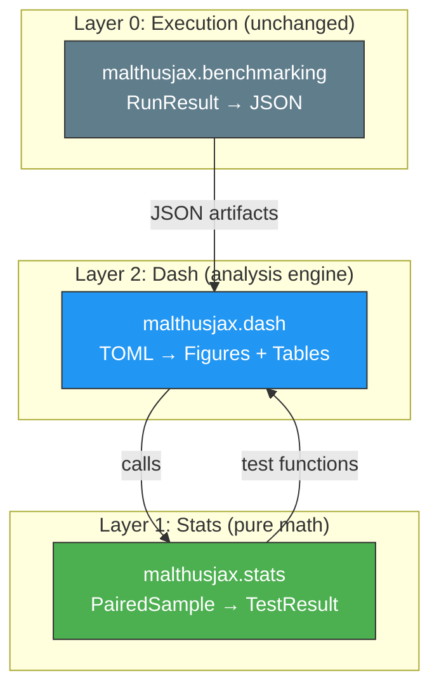

# MalthusDash: Final Design (v3)

*Kedro-inspired. SOLID-principled. Deliberately simple.*

---

## Design Philosophy

### Lessons from Kedro

Kedro succeeds because it draws a **hard line** between *what* (configuration) and *how* (code):

| Kedro Concept | MalthusDash Equivalent | Principle |
|---------------|----------------------|-----------|
| **DataCatalog** (YAML) | `[sources]` TOML block | Data I/O is config, not code |
| **Node** (pure function) | Stat functions + plot generators | Pure functions: typed inputs → typed outputs |
| **Pipeline** (DAG of nodes) | `[[comparisons]]` blocks | Declarative wiring, not imperative loops |
| **Parameters** (YAML) | `[style]` block | Config should be data, not scattered kwargs |

The critical Kedro rule we adopt: **nodes never know where data comes from.** A stat function receives a `PairedSample`. It doesn't know if that sample was loaded from JSON, CSV, a database, or constructed in a Jupyter notebook. The catalog handles the I/O; the node handles the math.

### SOLID in Practice

| Principle | How we apply it |
|-----------|----------------|
| **S**ingle Responsibility | `stats.tests` runs tests. `stats.effects` computes effect sizes. `ScalingPlot` renders scaling plots. Period. |
| **O**pen/Closed | Registries for tests, diagnostics, and plots. Add new types by registering, not by modifying existing code. |
| **L**iskov Substitution | Every `BasePlotGenerator` subclass is interchangeable. Every test function returns `TestResult`. |
| **I**nterface Segregation | `stats` doesn't depend on `matplotlib`. Users who only need math install `[stats]`, not `[dash]`. |
| **D**ependency Inversion | The TOML engine depends on the `BasePlotGenerator` protocol, not on `ScalingPlot` directly. Stats functions depend on `PairedSample`, not on `ComparisonResult`. |

### What we intentionally avoid

- ❌ No abstract factory hierarchies
- ❌ No plugin entry points (until we actually need them)
- ❌ No metaclasses or descriptor magic
- ❌ No "framework within a framework" — if you can do it with a function, don't make it a class

---

## The Three Layers



**Layer 0 (`benchmarking`)** produces JSON. Unchanged.
**Layer 1 (`stats`)** is pure math. Knows only typed dataclasses. No DataFrames, no matplotlib, no I/O.
**Layer 2 (`dash`)** wires everything together. Reads TOML, loads data, calls stats, renders plots.

---

## Layer 1: `malthusjax.stats`

### The Data Structures Stats Knows About

Stats operates on **three simple containers**. These are its entire world:

```python
# stats/core.py

from dataclasses import dataclass, field
import numpy as np


@dataclass(frozen=True)
class MetricVector:
    """A named 1D array of scalar observations. The atom of all stats."""
    name: str                    # e.g., "execution_time", "best_fitness"
    values: np.ndarray           # shape (n_samples,)
    metadata: dict = field(default_factory=dict)  # optional tags

    @property
    def n(self) -> int:
        return self.values.shape[0]


@dataclass(frozen=True)
class PairedSample:
    """Two aligned MetricVectors from matched observations (e.g., same seed)."""
    left: MetricVector
    right: MetricVector
    label: str = ""              # e.g., "mjx_wrapper_vs_evosax_baseline"

    def __post_init__(self):
        if self.left.n != self.right.n:
            raise ValueError(
                f"Paired sample size mismatch: {self.left.n} vs {self.right.n}"
            )

    @property
    def n(self) -> int:
        return self.left.n

    @property
    def diffs(self) -> np.ndarray:
        return self.left.values - self.right.values


@dataclass(frozen=True)
class RegressionDataset:
    """Labeled arrays for OLS modeling. Still no DataFrame."""
    y: np.ndarray                     # dependent variable
    X: dict[str, np.ndarray]          # named independent variables
    treatment_col: str = "is_treatment"
    interaction_col: str | None = None  # e.g., "log_D"
    label: str = ""
```

That's it. Stats never sees a DataFrame, a JSON file, or a file path. It receives these containers and returns typed results.

### The Result Types

Every stat function returns a typed, serializable result:

```python
# stats/core.py (continued)

@dataclass(frozen=True)
class TestResult:
    """Output of any single statistical test."""
    name: str                    # "wilcoxon", "paired_t", "tost", etc.
    statistic: float | None
    p_value: float | None
    alternative: str             # "two-sided", "less", "greater"

    def passes(self, alpha: float = 0.05) -> bool | None:
        if self.p_value is None:
            return None
        return self.p_value > alpha  # parity: fail to reject H0 = pass


@dataclass(frozen=True)
class EffectSize:
    """Output of an effect size computation."""
    name: str                    # "cohens_dz", "rank_biserial"
    value: float | None


@dataclass(frozen=True)
class DiagnosticResult:
    """Output of a regression diagnostic (e.g., Breusch-Pagan)."""
    name: str                    # "breusch_pagan", "shapiro_wilk"
    statistic: float | None
    p_value: float | None

    def passes(self, alpha: float = 0.05) -> bool | None:
        """H0: assumptions hold. Passes if we fail to reject."""
        if self.p_value is None:
            return None
        return self.p_value > alpha


@dataclass
class OLSResult:
    """Output of an OLS regression fit."""
    coefficients: dict[str, float]    # {"const": ..., "is_treatment": ..., ...}
    p_values: dict[str, float]        # standard p-values
    robust_p_values: dict[str, dict[str, float]]  # {"HC0": {...}, "HC3": {...}}
    r_squared: float
    diagnostics: list[DiagnosticResult]
    label: str = ""
```

### The Functions

Each submodule contains **plain functions**. No classes unless orchestration genuinely requires state:

```python
# stats/tests.py — pure functions, PairedSample in, TestResult out

def wilcoxon(sample: PairedSample, alternative: str = "two-sided") -> TestResult: ...
def paired_t(sample: PairedSample, alternative: str = "two-sided") -> TestResult: ...
def sign_test(sample: PairedSample, alternative: str = "two-sided") -> TestResult: ...
def tost(sample: PairedSample, margin: float, alpha: float = 0.05) -> TestResult: ...
```

```python
# stats/effects.py — MetricVector or PairedSample in, EffectSize out

def cohens_dz(sample: PairedSample) -> EffectSize: ...
def rank_biserial(sample: PairedSample) -> EffectSize: ...
def glass_delta(sample: PairedSample) -> EffectSize: ...
```

```python
# stats/regression.py — RegressionDataset in, OLSResult out

def fit_ols(data: RegressionDataset, robust: list[str] | None = None) -> OLSResult: ...
def fit_interaction_model(
    data: RegressionDataset,
    dependent_var: str,
    treatment_col: str,
    scale_cols: list[str],
    interaction_col: str,
    log_transform: bool = True,
    robust: list[str] | None = None,
) -> OLSResult: ...
```

```python
# stats/diagnostics.py — OLSResult in, DiagnosticResult out

def breusch_pagan(result: OLSResult) -> DiagnosticResult: ...
def shapiro_wilk(result: OLSResult) -> DiagnosticResult: ...
```

```python
# stats/correction.py — list of p-values in, corrected list out

def holm_bonferroni(p_values: list[float]) -> list[float]: ...
def fdr_bh(p_values: list[float]) -> list[float]: ...
```

### The Registry

A simple dictionary mapping strings to callables. Nothing more:

```python
# stats/registry.py

from typing import Callable

_TEST_REGISTRY: dict[str, Callable] = {}
_EFFECT_REGISTRY: dict[str, Callable] = {}
_DIAGNOSTIC_REGISTRY: dict[str, Callable] = {}
_CORRECTION_REGISTRY: dict[str, Callable] = {}


def register_test(name: str, fn: Callable) -> None:
    _TEST_REGISTRY[name] = fn

def get_test(name: str) -> Callable:
    if name not in _TEST_REGISTRY:
        raise KeyError(f"Unknown test: '{name}'. Available: {list(_TEST_REGISTRY)}")
    return _TEST_REGISTRY[name]

# Identical pattern for effects, diagnostics, corrections.
# Populated in stats/__init__.py:
#   register_test("wilcoxon", tests.wilcoxon)
#   register_test("paired_t", tests.paired_t)
#   register_effect("cohens_dz", effects.cohens_dz)
#   register_diagnostic("breusch_pagan", diagnostics.breusch_pagan)
#   register_correction("holm_bonferroni", correction.holm_bonferroni)
```

No decorators, no metaclasses, no plugin system. Just a dict. If you want to add a custom test, call `register_test("my_test", my_fn)` before running the plan. When it's justified later, we can add decorator sugar.

### Serialization

Every result type gets a `to_dict()` method (already exists in your current dataclasses). A single utility module handles the rest:

```python
# stats/io.py

def results_to_latex(results: list[TestResult | OLSResult], ...) -> str: ...
def results_to_csv(results: list[TestResult | OLSResult], path: Path) -> None: ...
def results_to_markdown(results: list[TestResult | OLSResult]) -> str: ...
```

---

## Layer 2: `malthusjax.dash`

### The Catalog (`[sources]`)

Directly analogous to Kedro's DataCatalog. Each source is a **named handle** to a directory of JSON artifacts:

```toml
[sources.dah2_parity]
path = "results/h1_parity"
hardware = "RTX_3090"
tags = ["parity"]

[sources.a100_parity]
path = "external/a100/h1_parity"
hardware = "A100"
```

In Python, the catalog is a thin wrapper:

```python
# dash/catalog.py

@dataclass
class Source:
    name: str
    path: Path
    hardware: str = ""
    tags: list[str] = field(default_factory=list)

class DataCatalog:
    """Registry of named data sources. Loads lazily."""

    def __init__(self):
        self._sources: dict[str, Source] = {}
        self._cache: dict[str, pd.DataFrame] = {}

    def register(self, name: str, path: str | Path, **kwargs) -> None:
        self._sources[name] = Source(name=name, path=Path(path), **kwargs)

    def load(self, name: str) -> pd.DataFrame:
        """Load and cache the raw data from a source."""
        if name not in self._cache:
            self._cache[name] = parse_json_artifacts(self._sources[name].path)
        return self._cache[name]

    @classmethod
    def from_toml(cls, sources_dict: dict) -> "DataCatalog":
        catalog = cls()
        for name, cfg in sources_dict.items():
            catalog.register(name, **cfg)
        return catalog
```

> [!NOTE]
> DataFrames live **only inside the dash layer**. The catalog produces DataFrames; the comparison engine extracts `PairedSample` / `RegressionDataset` objects from them and hands those to `stats`. Stats never sees a DataFrame.

### Inline Filters

Filters are applied when extracting data from a source, not when loading:

```toml
[comparisons.target]
source = "dah2_ablation"
pipeline = "mjx_ablate_mutation"
filters = { fn_name = ["sphere", "rosenbrock"], D = { min = 10, max = 500 } }
```

Implemented as a simple DataFrame mask builder:

```python
# dash/filters.py

def apply_filters(df: pd.DataFrame, filters: dict) -> pd.DataFrame:
    """Apply TOML filter dict to a DataFrame. Supports equality, lists, and min/max."""
    mask = pd.Series(True, index=df.index)
    for col, spec in filters.items():
        if isinstance(spec, list):
            mask &= df[col].isin(spec)
        elif isinstance(spec, dict):
            if "min" in spec:
                mask &= df[col] >= spec["min"]
            if "max" in spec:
                mask &= df[col] <= spec["max"]
        else:
            mask &= df[col] == spec
    return df[mask]
```

Three filter types, one function, no magic.

### The Comparison Engine

The engine reads a `[[comparisons]]` block, extracts the right data from the catalog, builds the stats containers, runs the requested tests, and passes results to the plotting layer:

```python
# dash/engine.py

class ComparisonEngine:
    """Executes one [[comparisons]] block."""

    def __init__(self, catalog: DataCatalog, comparison_config: dict):
        self.catalog = catalog
        self.config = comparison_config

    def run(self) -> ComparisonOutput:
        mode = self.config["mode"]
        if mode == "standalone":
            return self._run_standalone()
        elif mode == "paired":
            return self._run_paired()
        elif mode == "multi":
            return self._run_multi()
        raise ValueError(f"Unknown comparison mode: {mode}")

    def _run_paired(self) -> ComparisonOutput:
        # 1. Load data from catalog
        target_df = self._load_pipeline(self.config["target"])
        ref_df = self._load_pipeline(self.config["reference"])

        # 2. Pair on keys
        paired_df = self._pair(target_df, ref_df)

        # 3. For each function × metric, build PairedSample and run stats
        results = []
        for fn_name in paired_df["fn_name"].unique():
            for metric in self._requested_metrics():
                sample = self._extract_paired_sample(paired_df, fn_name, metric)
                stat_results = self._run_stats(sample)
                results.append(stat_results)

        # 4. Apply correction if requested
        if correction := self.config.get("statistics", {}).get("correction"):
            results = self._apply_correction(results, correction)

        return ComparisonOutput(
            name=self.config["name"],
            results=results,
            paired_df=paired_df,  # kept for plotting
        )
```

### Plot Style: CSS Cascading

Global defaults are set in `[style]`. Per-plot blocks override specific fields. Everything else inherits:

```python
# dash/plotting/style.py

@dataclass
class PlotStyle:
    figsize: tuple[float, float] = (8, 6)
    dpi: int = 300
    palette: str = "colorblind"
    font_family: str = "sans-serif"
    font_size: int = 12
    title_size: int = 14
    label_size: int = 11
    legend_location: str = "best"
    legend_title: str | None = None
    grid: bool = True
    grid_alpha: float = 0.3
    tight_layout: bool = True
    pipeline_colors: dict[str, str] | None = None

    def merge(self, overrides: dict) -> "PlotStyle":
        """CSS-style merge: overrides replace individual fields, rest inherited."""
        merged = {**vars(self)}
        for key, value in overrides.items():
            if key in merged:
                merged[key] = value
        return PlotStyle(**merged)
```

The merge rule is dead simple: `PlotStyle.merge(per_plot_dict)` returns a new style with only the specified fields replaced.

### Plot Generators: The Contract

Every plot generator follows one rule: **`render()` returns a `Figure`**:

```python
# dash/plotting/base.py

from abc import ABC, abstractmethod
from matplotlib.figure import Figure

class BasePlotGenerator(ABC):
    """All plot generators implement this. Nothing else required."""

    def __init__(self, style: PlotStyle, **kwargs):
        self.style = style

    @abstractmethod
    def render(self) -> Figure:
        """Create and return a Figure. Never saves to disk."""
        ...
```

Concrete generators are simple, focused classes:

```python
# dash/plotting/scaling.py

class ScalingPlot(BasePlotGenerator):
    def __init__(self, data, x_axis, metric, hue_col, style, **kwargs):
        super().__init__(style)
        self.data = data
        self.x_axis = x_axis
        self.metric = metric
        self.hue_col = hue_col
        self.kwargs = kwargs

    def render(self) -> Figure:
        fig, ax = plt.subplots(figsize=self.style.figsize, dpi=self.style.dpi)
        # ... seaborn lmplot or manual scatter + regression line ...
        ax.set_title(self.kwargs.get("title", ""))
        ax.set_xlabel(self.kwargs.get("x_label", f"ln({self.x_axis})"))
        ax.set_ylabel(self.kwargs.get("y_label", f"ln({self.metric})"))
        if self.style.tight_layout:
            fig.tight_layout()
        return fig
```

### Title Templates

Titles support `{variable}` substitution. Resolved at render time:

```python
# dash/plotting/templates.py

def resolve_title(template: str, context: dict) -> str:
    """Simple str.format_map with safe fallback for missing keys."""
    try:
        return template.format_map(context)
    except KeyError:
        return template
```

Template variables: `{target}`, `{reference}`, `{function}`, `{metric}`, `{hardware}`.

### The Plan (Top-Level Orchestrator)

```python
# dash/plan.py

class AnalysisPlan:
    """Reads a TOML, wires catalog → engine → stats → plots."""

    @classmethod
    def from_toml(cls, path: str | Path) -> "AnalysisPlan":
        """Load a plan, resolving includes."""
        config = _load_with_includes(Path(path))
        return cls(config)

    def execute(self, return_figures: bool = False) -> dict[str, Figure] | None:
        catalog = DataCatalog.from_toml(self.config.get("sources", {}))
        global_style = PlotStyle(**self.config.get("style", {}))
        output_dir = Path(self.config["meta"]["output_dir"])
        figures = {}

        for comp_config in self.config.get("comparisons", []):
            engine = ComparisonEngine(catalog, comp_config)
            output = engine.run()

            for plot_config in comp_config.get("plots", []):
                style = global_style.merge(plot_config)  # CSS cascade
                plot_cls = PLOT_REGISTRY[plot_config["type"]]
                plot = plot_cls(data=output, style=style, **plot_config)

                fig = plot.render()
                name = f"{comp_config['name']}/{plot_config['type']}"
                fig.savefig(output_dir / f"{name}.png", dpi=style.dpi)
                if return_figures:
                    figures[name] = fig
                else:
                    plt.close(fig)

        return figures if return_figures else None
```

### Composable TOMLs (`includes`)

Analysis TOMLs can include other TOMLs. Sources and styles are merged, comparisons are appended:

```toml
[meta]
name = "chapter_5_complete"
includes = [
    "analysis/common_sources.toml",
    "analysis/publication_style.toml",
]
```

Implementation is just recursive TOML loading with dict merge:

```python
# dash/config.py

def _load_with_includes(path: Path) -> dict:
    config = toml.load(path)
    for include_path in config.get("meta", {}).pop("includes", []):
        included = _load_with_includes(path.parent / include_path)
        config = _deep_merge(config, included)
    return config

def _deep_merge(base: dict, override: dict) -> dict:
    """Merge override into base. Lists are appended, dicts are recursed."""
    result = dict(base)
    for key, value in override.items():
        if key in result and isinstance(result[key], dict) and isinstance(value, dict):
            result[key] = _deep_merge(result[key], value)
        elif key in result and isinstance(result[key], list) and isinstance(value, list):
            result[key] = result[key] + value  # comparisons are appended
        else:
            result[key] = value
    return result
```

---

## Package Tree (Final)

```
src/malthusjax/
├── core/              # BaseGenome, BasePopulation (unchanged)
├── operators/         # 3-Tier operators (unchanged)
├── engine/            # GeneticFastEngine (unchanged)
├── composer/          # TOML DSL, Composer (unchanged)
├── compat/            # Adapters (unchanged)
├── benchmarking/      # Layer 0: RunResult, Runner, IO (unchanged)
│
├── stats/             # Layer 1: Pure math
│   ├── __init__.py    #   Public API + registry population
│   ├── core.py        #   MetricVector, PairedSample, RegressionDataset,
│   │                  #   TestResult, EffectSize, DiagnosticResult, OLSResult
│   ├── tests.py       #   wilcoxon(), paired_t(), sign_test(), tost()
│   ├── effects.py     #   cohens_dz(), rank_biserial()
│   ├── regression.py  #   fit_ols(), fit_interaction_model()
│   ├── diagnostics.py #   breusch_pagan(), shapiro_wilk()
│   ├── correction.py  #   holm_bonferroni(), fdr_bh()
│   ├── registry.py    #   String → callable dicts
│   └── io.py          #   to_latex(), to_csv(), to_markdown()
│
└── dash/              # Layer 2: Analysis engine
    ├── __init__.py
    ├── config.py       #   TOML loading + includes
    ├── catalog.py      #   DataCatalog (source registry)
    ├── filters.py      #   apply_filters()
    ├── engine.py       #   ComparisonEngine (standalone/paired/multi)
    ├── plan.py         #   AnalysisPlan (top-level orchestrator)
    ├── plotting/
    │   ├── __init__.py
    │   ├── style.py    #   PlotStyle + CSS merge
    │   ├── base.py     #   BasePlotGenerator protocol
    │   ├── scaling.py  #   ScalingPlot
    │   ├── boxplot.py  #   BoxPlot
    │   ├── histogram.py
    │   ├── heatmap.py
    │   ├── convergence.py
    │   ├── speedup.py
    │   ├── tables.py   #   RegressionTable, ParityTable
    │   ├── templates.py #  Title template resolver
    │   └── registry.py #  PLOT_REGISTRY dict
    └── cli.py          #   CLI entry point
```

### Dependencies

```toml
# pyproject.toml
[project.optional-dependencies]
stats = ["scipy>=1.11", "statsmodels>=0.14", "numpy"]
dash = ["malthusjax[stats]", "matplotlib>=3.8", "seaborn>=0.13", "pandas>=2.0"]
```

`pip install malthusjax` → core framework
`pip install malthusjax[stats]` → adds stats layer (headless OK)
`pip install malthusjax[dash]` → adds the full analysis engine

---

## Full Worked Example

### `analysis/common_sources.toml`
```toml
[sources.parity]
path = "results/h1_parity"
hardware = "RTX_3090"

[sources.ablation]
path = "results/h2_ablation"
hardware = "RTX_3090"

[sources.representation]
path = "results/h3_representation"
hardware = "RTX_3090"
```

### `analysis/publication_style.toml`
```toml
[style]
dpi = 300
figsize = [8, 6]
palette = "colorblind"
font_family = "Inter"
font_size = 12
title_size = 14
grid = true
tight_layout = true

[style.pipeline_colors]
"evosax_baseline" = "#E24A33"
"malthusjax_wrapper" = "#348ABD"
"mjx_baseline" = "#777777"
```

### `analysis/chapter_5.toml`
```toml
[meta]
name = "chapter_5"
output_dir = "analysis/chapter_5"
includes = ["common_sources.toml", "publication_style.toml"]

# ─── H1: Parity ─────────────────────────────────────────────────────────────

[[comparisons]]
name = "h1_parity"
mode = "paired"

[comparisons.target]
source = "parity"
pipeline = "malthusjax_wrapper"

[comparisons.reference]
source = "parity"
pipeline = "evosax_baseline"

pair_on = ["fn_name", "seed", "D", "P", "G"]

[comparisons.statistics]
wilcoxon = true
tost = { enabled = true, delta_fraction = 0.2 }
cohens_dz = true
ols_scaling = true
ols_diagnostics = ["breusch_pagan", "shapiro_wilk"]
robust_se = ["HC3"]
correction = "holm_bonferroni"

[[comparisons.plots]]
type = "scaling"
metrics = ["execution_time", "best_fitness"]
x_axis = "D"
per_function = true
title = "{metric}: {target} vs {reference} ({function})"

[[comparisons.plots]]
type = "boxplot"
metrics = ["execution_time", "best_fitness"]
per_function = true

[[comparisons.plots]]
type = "regression_table"
format = ["tex", "csv"]

# ─── H2: Ablation ───────────────────────────────────────────────────────────

[[comparisons]]
name = "h2_ablation"
mode = "multi"

[comparisons.reference]
source = "ablation"
pipeline = "mjx_baseline"

[[comparisons.targets]]
source = "ablation"
pipeline = "mjx_ablate_mutation"
label = "Native Mutation"

[[comparisons.targets]]
source = "ablation"
pipeline = "mjx_ablate_crossover"
label = "Native Crossover"

[[comparisons.targets]]
source = "ablation"
pipeline = "mjx_ablate_sel_tournament"
label = "Native Tournament"

[[comparisons.targets]]
source = "ablation"
pipeline = "mjx_ablate_sel_elite"
label = "Native Elite Pool"

pair_on = ["fn_name", "seed", "D", "P", "G"]

[comparisons.statistics]
ols_scaling = true
robust_se = ["HC3"]
correction = "holm_bonferroni"

[[comparisons.plots]]
type = "scaling"
metrics = ["execution_time"]
x_axis = "D"
overlay = true
per_function = true
figsize = [12, 7]
legend_title = "Operator Variant"

[[comparisons.plots]]
type = "regression_table"
format = ["tex", "csv", "md"]
```

### Running it

```bash
# One command reproduces all of Chapter 5
malthusdash run analysis/chapter_5.toml

# Or in Python
from malthusjax.dash import AnalysisPlan
plan = AnalysisPlan.from_toml("analysis/chapter_5.toml")
figures = plan.execute(return_figures=True)

# Grab a figure and modify it
fig = figures["h1_parity/scaling/execution_time/sphere"]
fig.axes[0].axhline(y=0, color="red", linestyle="--")
fig.savefig("annotated.pdf")
```

---

## Summary of Locked-In Decisions

| Question | Decision |
|----------|----------|
| Stats ↔ DataFrames | **Stats never sees DataFrames.** It operates on `PairedSample`, `MetricVector`, `RegressionDataset`. Dash does all DataFrame wrangling. |
| Plot style inheritance | **CSS cascading.** Per-plot overrides merge with `[style]`; unspecified fields are inherited. |
| Inline filters | **Yes.** `filters = { fn_name = [...], D = { min, max } }` on any source reference. |
| Composable TOMLs | **Yes.** `includes = [...]` in `[meta]`. Sources/styles merge, comparisons append. |
| Figure return | **Always.** `render()` → `Figure`. TOML batch mode saves + closes. Python mode gives you the handle. |
| Over-engineering | **Registries are dicts. Plot generators are classes with one method. Stat functions are functions. No metaclasses, no plugins, no decorators until we need them.** |
