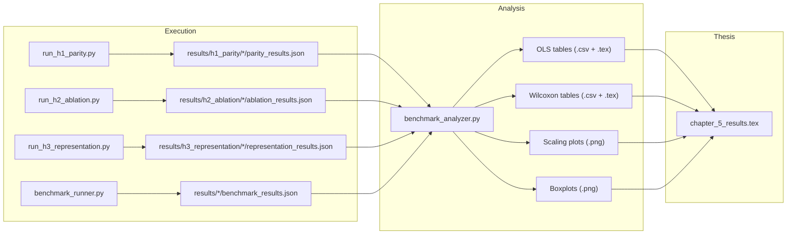

# MalthusJAX Thesis & Benchmarking Pipeline — Complete Review

## Overview

I've read every file you shared. Here's the complete map of your thesis chapters, scripts, and data artifacts.

---

## 1. Thesis Chapters

### [Chapter 3: System Architecture](file:///Users/leonardodicaterina/Documents/GitHub/MalthusJAX/thesis_chapters/chapter_3_draft.md) (198 lines)

Covers the full 5-layer architecture:

| Layer | Section | Key Abstractions |
|-------|---------|-----------------|
| Data | §3.2 | `BaseGenome` (atom, N=1) ↔ `BasePopulation` (SoA, N>1), `jax.vmap` delegation |
| Evaluation | §3.3 | `evaluate()` → scalar, `evaluate_population()` → posterior transforms |
| Operators | §3.4 | **3-Tier**: Tier 1 (arithmetic kernel), Tier 2 (PRNG), Tier 3 (batch `vmap`) |
| PRNG | §3.5 | `ResourceMapper` pre-allocates master key buffer; THREEFRY/RBG/PHILOX + SPLIT/FOLD |
| Engine | §3.6 | 5-Phase `step()` → `jax.lax.scan` → single XLA payload |
| Orchestration | §3.7 | `Composer` + String DSL + TOML pipelines |
| Adapters | §3.8 | Engine-level facades + Operator-level wrappers; unified `ExperimentResult` serialization |
| Engineering | §3.9 | PEP-621 `pyproject.toml`, tiered `mypy`, `ruff`, `Makefile` CLI |

---

### [Chapter 4: Methodology](file:///Users/leonardodicaterina/Documents/GitHub/MalthusJAX/thesis_chapters/chapter_4_draft.md) (134 lines)

Three experimental phases:

| Phase | Hypothesis | What it tests |
|-------|-----------|---------------|
| **H1 Parity** | MJX ≡ EvoSAX mathematically | Closed-loop adapter, seed alignment, TOST equivalence |
| **H2 Ablation** | Structural overhead of modularity | Swap one native operator at a time vs. wrapped EvoSAX mimics |
| **H3 Representation** | Precision invariance | float32 vs bfloat16 vs float16 |

**Parameter grid**: D ∈ {10,50,100,500}, P ∈ {64..16384}, 100 seeds, 6 BBOB functions.
**LHS**: 30 samples × 3 hypotheses × 3 functions = 270 configs → 27,000 runs (97% reduction).
**Statistics**: Log-log OLS ($\beta_3$ interaction), Wilcoxon, Cohen's $d_z$, Breusch-Pagan, Shapiro-Wilk.

---

### [Chapter 5: Results](file:///Users/leonardodicaterina/Documents/GitHub/MalthusJAX/thesis_chapters/chapter_5_results_draft.md) (100 lines) + [LaTeX version](file:///Users/leonardodicaterina/Documents/GitHub/MalthusJAX/thesis_chapters/chapter_5_results.tex) (103 lines)

| Hypothesis | Key Finding | Statistical Evidence |
|-----------|-------------|---------------------|
| **H1** | MJX scales identically to EvoSAX | $\beta_3$ non-sig for exec time ($p>0.48$); Cohen's $d_z$ negligible (≈ -0.04) |
| **H2** | Mutation & Crossover: zero overhead | $\beta_3$ non-sig ($p>0.60$) |
| **H2** | **Selection: asymptotically faster** | $\beta_3 \approx -0.05$, $p<0.001$ for Tournament + Elite Pool |
| **H2** | Pareto tradeoff at $K=3$ | Fitness degrades at high $D$; fixed by calibrating $K=6$ |
| **H3** | bf16/f16 precision parity | $\beta_3$ non-sig ($p>0.37$); fitness $p > 0.999$ |

---

## 2. Benchmarking Pipeline Scripts

### Data Flow

---

### [benchmark_runner.py](file:///Users/leonardodicaterina/Documents/GitHub/MalthusJAX/scripts/benchmark_runner.py) — Unified TOML-Driven Runner (242 lines)

The **newer, generalized** runner that replaces the 3 hypothesis-specific scripts:
- Parses `.toml` suite definitions via `BenchmarkConfig.from_toml()`
- Generates grids via `generate_grid()` (supports both Cartesian and LHS modes)
- Formats pipeline strings with dynamic `{pop_size}`, `{genome_length}`, `{elite_k}` substitution
- Executes via `Composer.compare()` with shared initial populations
- Saves per-experiment `benchmark_results.json` + suite-level `suite_summary.json`
- Memory protection: `jax.clear_caches()` + `gc.collect()` after each experiment
- Supports `--smoke` mode (2 coords, 3 seeds)

### [benchmark_analyzer.py](file:///Users/leonardodicaterina/Documents/GitHub/MalthusJAX/scripts/benchmark_analyzer.py) — Unified Analyzer (393 lines)

Consumes the JSON artifacts and produces all statistical outputs:

| Function | Purpose |
|----------|---------|
| `parse_global_data()` | Recursively finds all JSON artifacts, handles both TOML-engine and legacy formats |
| `synthesize_regression_dataset()` | Pairs target vs. reference pipelines on (fn, seed, D, P, G) |
| `run_ols_diagnostics()` | Log-log OLS with $\beta_1$, $\beta_3$, Breusch-Pagan, Shapiro-Wilk |
| `generate_boxplots()` | Side-by-side execution time + fitness boxplots |
| `generate_scaling_plots()` | Log-log `lmplot` with regression lines per pipeline |
| `export_latex_safe()` | LaTeX table export with `jinja2` fallback |

> [!NOTE]
> The analyzer auto-detects dimensionality: if only 1 unique $D$ exists (Cartesian mode), it falls back to Wilcoxon parity tests instead of OLS scaling regressions.

---

### Legacy Scripts in [parity_working/](file:///Users/leonardodicaterina/Documents/GitHub/MalthusJAX/scripts/parity_working)

These are the **original hardcoded** scripts that produced the cluster results:

| Script | Lines | Pipelines | Output Pattern |
|--------|-------|-----------|----------------|
| [run_h1_parity.py](file:///Users/leonardodicaterina/Documents/GitHub/MalthusJAX/scripts/parity_working/run_h1_parity.py) | 403 | `evosax_baseline` + `malthusjax_wrapper` | `parity_results.json` |
| [run_h2_ablation.py](file:///Users/leonardodicaterina/Documents/GitHub/MalthusJAX/scripts/parity_working/run_h2_ablation.py) | 426 | `mjx_baseline` + 4 ablation variants | `ablation_results.json` |
| [run_h3_representation.py](file:///Users/leonardodicaterina/Documents/GitHub/MalthusJAX/scripts/parity_working/run_h3_representation.py) | 410 | `mjx_f32` + `mjx_bf16` + `mjx_f16` | `representation_results.json` |

All three share identical structure: CLI with `--smoke`/`--functions`/`--dims`/`--pops`/`--gens`/`--seeds`, nested Cartesian grid loop, `Composer.compare()` execution, JAX cache clearing.

> [!IMPORTANT]
> The `benchmark_analyzer.py` is **backward-compatible** with both the legacy scripts AND the new TOML runner — it searches for all 4 JSON patterns (`benchmark_results.json`, `parity_results.json`, `ablation_results.json`, `representation_results.json`).

---

## 3. TOML Configuration Layer

The TOML configs define the declarative experiment specifications consumed by `benchmark_runner.py`:

| Config | Mode | Functions | Grid |
|--------|------|-----------|------|
| [h1_parity_lhs.toml](file:///Users/leonardodicaterina/Documents/GitHub/MalthusJAX/configs/h1_parity_lhs.toml) | LHS | sphere, rosenbrock, rastrigin | D∈[2,100], P∈[10,1000], G∈[10,1000], N=30 |
| [h2_ablation_lhs.toml](file:///Users/leonardodicaterina/Documents/GitHub/MalthusJAX/configs/h2_ablation_lhs.toml) | LHS | sphere, rosenbrock, rastrigin | Same grid, 5 pipelines |
| [h1_parity_cartesian.toml](file:///Users/leonardodicaterina/Documents/GitHub/MalthusJAX/configs/h1_parity_cartesian.toml) | Cartesian | — | Discrete grid |

---

## 4. Current State of Results

| Directory | Status | Contents |
|-----------|--------|----------|
| `results/h1_parity/` | ✅ Complete | 9 plots, Wilcoxon + OLS tables, 1,057-row CSV |
| `results/h2_ablation/` | ✅ Complete | 60 plots, OLS table (24 rows), 5.1M unpivoted CSV |
| `results/h3_representation/` | ✅ Complete | 30 plots, OLS table (12 rows), 1.9M unpivoted CSV |
| `results/h1_parity_lhs_smoke/` | ✅ Complete | 2 LHS experiments, analysis subdir |
| `results/h2_ablation_smoke/` | ✅ Complete | Smoke test artifacts |
| `results/h3_representation_smoke/` | ✅ Complete | Smoke test artifacts |

> [!WARNING]
> The [output.txt](file:///Users/leonardodicaterina/Documents/GitHub/MalthusJAX/scripts/parity_working/output.txt) log (4,631 lines) appears to be **truncated** — it cuts off mid-run at seed 50/100 of what looks like a later experiment. This suggests the cluster run may have been interrupted or the output was only partially captured.

---

## 5. What would you like me to do next?

Now that I have a complete picture of your thesis chapters and the entire data pipeline, I can help with:

- **Extending Chapter 5** with the Hard Suite results (Lunacek, Schwefel, Gallagher) or the LHS OLS regressions
- **Improving the statistical pipeline** (e.g., adding TOST tests, Huber-White robust SEs, multi-comparison corrections)
- **Debugging or optimizing** the runner/analyzer scripts
- **Writing new chapters** or expanding existing sections
- **Creating new visualizations** or publication-quality plots
- **Reviewing the methodology** for statistical soundness

Let me know what direction you'd like to go!
