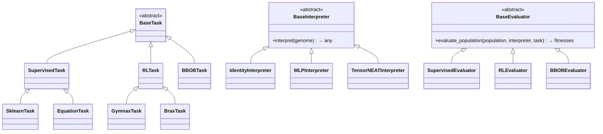

# Evaluator Architecture: Why We Need Decomposition

## The Core Observation

When you look at a simple GA loop, all it needs is:
```
population → [evaluator] → fitness scores
```
The engine doesn't care *how* fitness is computed. That's the only contract. But inside that `[evaluator]` box, two completely **independent** concerns are currently tangled together.

---

## The Two Hidden Concerns Inside Every Evaluator

### 1. Genome Interpretation (`Interpreter`)
How do we turn a raw genome (a JAX array of numbers) into something that can *act* in an environment?

- **RealGenome → Direct Vector**: BBOB, Sphere — the raw `values` array *is* the solution, no interpretation needed.
- **RealGenome → MLP weights**: Gymnax — the flat array is unflattened into MLP parameters via `unflatten_fn`.
- **LinearGPGenome → Program**: MEP — the integer array is executed as a stack-based program.
- **TensorNEATGenome → Neural Network**: The `(nodes, conns)` arrays define a graph that TensorNEAT compiles to a forward function.

### 2. Task (`Task`)
What environment or dataset does the interpreted genome interact with to produce a scalar fitness?

- **No environment**: BBOB, Sphere — just call `f(x)`.
- **Static dataset**: Supervised Learning — run the interpreter over `(X, y)` and compute MSE/BCE.
- **Dynamic environment**: RL — step through `env.reset()` / `env.step()` for N episodes.
- **Black-box oracle**: BBOBAx — call an external benchmark function.

---

## What the Current Architecture Bundles Together

Let's look at what today's evaluators actually contain:

| Evaluator | Interpreter (hidden) | Task (hidden) |
|---|---|---|
| `SphereEvaluator` | Identity (raw array = solution) | Sphere analytic function |
| `BBOBEvaluator` | Identity | BBOB function via evosax |
| `GymnaxEvaluator` | RealGenome → MLP weights | Gymnax RL rollout |
| `LinearGPEvaluator` | RealGenome → MEP program string | Dataset `(X, y)` |
| `SklearnMEPEvaluator` | RealGenome → MEP program string | SKLearn dataset `(X, y)` |

Every single class is a **hard-coded fusion** of both. Adding a new dataset means rewriting a new class that bundles the genome interpretation logic again from scratch.

---

## The TensorNEAT Problem: Why This Is Now Critical

TensorNEAT is the breaking point of the current architecture. TensorNEAT has its **own** genome interpretation — it doesn't use `RealGenome`. Its genome is a `(nodes, conns)` graph, and its "interpreter" is TensorNEAT's internal `algorithm.forward(state, params, X)`.

So right now, if you want to evaluate a TensorNEAT population on a SKLearn dataset, you can't just plug `SklearnMEPEvaluator` in — it would try to interpret the genome as a MEP string. You have to write a completely custom bridge (`TensorNEATSupervisedProblem`). This is the combinatorial explosion.

---

## The Proposed Decomposition

We split into three clean, composable abstractions:



### `BaseTask` — The Environment/Data
Knows what data or environment to use. Nothing else.
```python
class SklearnTask(SupervisedTask):
    X: Array
    y: Array
```

### `BaseInterpreter` — The Genome Decoder
Knows how to turn a genome into something usable in a task.
```python
class MLPInterpreter(BaseInterpreter):
    def interpret(self, genome: RealGenome) -> Params:
        return self.unflatten_fn(genome.values)
        
class TensorNEATInterpreter(BaseInterpreter):
    def interpret(self, genome: TensorNEATGenome) -> ForwardFn:
        return partial(self.algorithm.forward, self.state)
```

### `BaseEvaluator` — The Evaluator Strategy
Knows *how* to run the evaluation loop (MSE over dataset, RL rollout, etc.) but nothing about the specific genome or dataset.
```python
class SupervisedEvaluator(BaseEvaluator):
    def evaluate_population(self, population, interpreter, task) -> Array:
        forward_fn = interpreter.interpret(population.genes)  # genome → callable
        X, y = task.X, task.y                                  # task → data
        preds = vmap(forward_fn)(X)
        return -mse(preds, y)                                   # fitness scores
```

---

## The Power: Mix-and-Match

| Interpreter | Task | Evaluator | Works? |
|---|---|---|---|
| `MLPInterpreter` | `SklearnTask` | `SupervisedEvaluator` | ✅ RealGenome on sklearn |
| `TensorNEATInterpreter` | `SklearnTask` | `SupervisedEvaluator` | ✅ TensorNEAT on sklearn! |
| `MLPInterpreter` | `GymnaxTask` | `RLEvaluator` | ✅ RealGenome on RL |
| `TensorNEATInterpreter` | `GymnaxTask` | `RLEvaluator` | ✅ TensorNEAT on RL! |
| `IdentityInterpreter` | `BBOBTask` | `BBOBEvaluator` | ✅ Simple GA on BBOB |

Zero new evaluator classes needed for new combinations.

---

## Remaining Challenge: The Composer Interface

Currently the Composer uses flat strings like `fitness="sklearn_mep"` which implicitly bundles all three. We'll need to discuss how to expose this three-part decomposition cleanly to the Composer API (e.g., `task="sklearn"`, `interpreter="mlp"`, `evaluator="supervised"`). This is the biggest user-facing breaking change to plan carefully.
