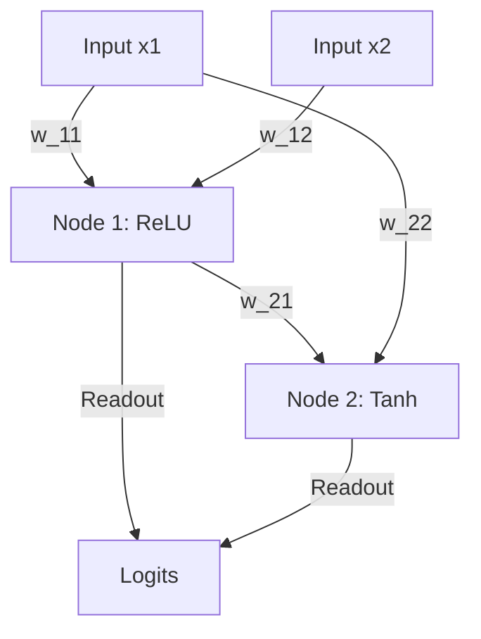

# Genomes: Architectural Representations

This document covers the architectural representations used in the LSP Project. The genomes map discrete structural topologies with continuous parameters, enabling hybrid evolutionary and gradient-based learning.

## 1. Cartesian Topologies (`CartesianGenome`)

The Cartesian topology structures the genome as a 2-dimensional grid of nodes, offering a highly structured and constraint-driven representation.

**Reference:**
> [CGP-2000] Miller, J. F., & Thomson, P. (2000). *Cartesian Genetic Programming*.

### The Grid Representation
CGP derives its name from its Cartesian coordinate system structure. A Cartesian program $P$ is defined by a grid with $n_r$ rows and $n_c$ columns, taking $n_i$ inputs and producing $n_o$ outputs. Every node in the grid has a fixed **arity** (number of inputs it accepts) and evaluates a function from a primitive set $F$.

The genotype $G$ is a fixed-length array of integers representing:
- The function (opcode) assigned to each node.
- The connections (pointers) determining where each node gets its inputs.
- The output connections determining which nodes provide the final $n_o$ program outputs.

### Interconnectivity & Arity Constraints
A critical parameter in CGP is $l$, the **levels back** parameter. It dictates how many previous columns of cells a node in the current column can connect to. 

To ensure a valid feed-forward network, CGP enforces strict mathematical constraints on the input connection genes ($c_{kj}$ for the $k$-th input of a node in column $j$). A node is explicitly forbidden from connecting to nodes in its own column or any columns to its right, and can only reach back $l$ columns. 

*In MalthusJAX:* We rigorously enforce these boundaries during evolution. Rather than relying on conditional runtime checks or branches (which are hostile to JAX's XLA compiler), we enforce topological integrity mathematically. We compute the lower bound using a pure boolean multiplier mask `(col >= levels_back) * (N + (col - levels_back) * nr)`, which acts as a Heaviside step function. This allows us to strictly enforce Miller's window using a single, ultra-fast vector operation.

### Fixed Genotype vs Variable Phenotype (Neutral Drift)
A defining property of CGP is that while the genotype length is fixed (maximum size), the **actual size of the active Cartesian program** can be anything from zero up to the maximum. 

Because CGP uses explicit output pointers, many nodes in the grid may be completely disconnected from the output path. These "non-coding" nodes create a phenomenon known as **neutral drift**. Mutations can occur on inactive nodes without altering the program's fitness. This allows the genome to silently build complex sub-structures in the background; a single subsequent mutation to an output pointer can then instantaneously activate this new structure, allowing CGP to escape local optima.

## 2. Linear & Prefix Topologies (`LinearGenome`)

If Cartesian GP is a structured 2D grid with rigid boundaries and explicit outputs, Multi Expression Programming (MEP) can be viewed as its unconstrained, heavily parallelized 1-Dimensional counterpart.

**Reference:** 
> [MEP-2001] Oltean, M. (2001). *Multi Expression Programming*.

### The Representation: Unconstrained 1D Sequences
While CGP uses an $n_r \times n_c$ grid constrained by a `levels_back` sliding window, MEP encodes programs as a flat, linear sequence of instructions ($n_r=1$). Furthermore, there is no $l$ constraint; any instruction in the sequence is free to point backward to *any* previous instruction or primary input. It reads identically to a compiler's three-address code.

*In MalthusJAX:* We capture this in the `LinearGenome` struct. Because there are no sliding windows to track, we simply flatten the operations and arguments into 1D JAX arrays (`ops`, `arg1`, `arg2`), guaranteeing maximum contiguous memory efficiency on the GPU.

### Strong Implicit Parallelism (SIP) vs Neutral Drift
In CGP, we discussed **Neutral Drift**—the phenomenon where "non-coding" nodes (disconnected from the explicit output pointers) can mutate silently without affecting fitness. 

MEP represents the philosophical opposite. In MEP, there are **no explicit output pointers** during evaluation. Instead, **every single node is treated as an output simultaneously**. This means there are no non-coding genes and no "silent" neutral drift. Every mutation immediately alters a sub-program. Because a single chromosome of length $L$ evaluates $L$ different expressions at once, it explores the search space massively in parallel—a concept Oltean defined as **Strong Implicit Parallelism (SIP)**.

### Dynamic Output Routing ("Best Gene Wins")
Because every node is an active phenotype, how do we determine the fitness of the chromosome? MEP dynamically evaluates *all* sub-programs against the target dataset and assigns the fitness of the entire chromosome to its best-performing sub-program. Rather than waiting for a mutation to move an `out_nodes` pointer (as in CGP), the "active" sub-graph in MEP jumps wildly around the genome whenever a mutation makes a different node achieve a better loss.

*In MalthusJAX:* We implemented this in our evaluators via the `mep_output_strategy="dynamic"`. By running a `jax.lax.scan` across the 1D sequence, we collect the outputs of all instructions in a single JIT-compiled sweep. We then compute the loss for every node and simply apply JAX reductions (`jnp.min`) across the sequence, extracting the winner instantly.

### SIP Trade-offs

The original paper outlines explicit pros and cons for this "evaluate everything" structure:

**Why encode multiple solutions within a chromosome (SIP)?**
1. **Search Space Efficiency:** Evaluating $L$ different sub-programs simultaneously dramatically increases the chance of finding a fit structure.
2. **Computational Free-Lunch (Forward Pass):** Because of the DAG structure, computing the forward pass of all $L$ sub-programs takes the exact same $O(L)$ time as computing a single long program, as partial results are naturally cached.
3. **Robustness to Destructive Mutation:** A destructive mutation near the end of the array might break the last gene, but an earlier, untouched gene can dynamically take over as the new "best" output, preserving fitness.

**Why NOT encode multiple solutions within a chromosome?**
1. **Evaluation Overhead (Loss Computation):** While the *forward pass* is $O(L)$, computing the *fitness/loss* for every single node across a large dataset can introduce significant computational overhead. *(Mitigated in MalthusJAX by vectorizing the loss computation using `jax.vmap`)*.
2. **Static Output Constraints:** Some problems strictly require a multi-dimensional or fixed-location output (e.g., controlling a robot with 4 specific joints). Dynamic routing complicates this. *(Mitigated in MalthusJAX by allowing a fallback to `mep_output_strategy="linear_readout"`)*.

## 3. The Differentiable Leap: dCGP and dCGPANN

To bridge evolutionary topologies with gradient-based continuous learning, we extended the discrete genomes using the principles of Differentiable Genetic Programming.

**Reference:**
> [dCGP-2017] Izzo, D., et al. (2017). *Differentiable Genetic Programming*.

### Leap 1: Pure dCGP (Analytical Derivatives)
Traditional GP evaluates rigid mathematical operations (like `+`, `*`, `sin`, `cos`) strictly as floating-point functions. The foundational innovation of Izzo's 2017 paper was evaluating the genetic program using the algebra of **truncated Taylor polynomials** (via a custom C++ library called `AuDi`). 

#### The Math of Dual Numbers (AuDi)
In this paradigm, inputs to the genetic program are not standard floats, but dual numbers: $x = x_0 + \epsilon$ (where $\epsilon^2 = 0$). Because the math operators in the GP are mathematically overloaded to handle these dual numbers via the chain rule, a single forward pass of the graph $f(x)$ naturally outputs $f(x_0) + f'(x_0)\epsilon$. The coefficient attached to $\epsilon$ is the exact analytical derivative ($\frac{\partial y}{\partial x}$)!

#### Differential Fitness Functions
This completely alters what fitness functions can represent. Instead of just fitting points for symbolic regression ($L = \sum (y - f(x))^2$), the fitness can be defined by the derivatives themselves. 
For example, to solve the differential equation $f'(x) = -f(x)$, the GP fitness function becomes the residual of the equation:
$$L = \sum_i \left( f'(x_i) + f(x_i) \right)^2 + \text{Boundary Conditions}$$
This mathematically forces the genetic algorithm to evolve the exact analytical equation that solves the PDE/ODE, or to discover conserved quantities in dynamical systems.

#### *In MalthusJAX:* JVP & VJP Auto-Diff
We achieve the exact theoretical capabilities of Pure dCGP, but with a massive architectural simplification. Because our evaluators process the DAG using `jax.lax.scan`, we completely bypass the need for custom Taylor polynomial libraries. 
JAX's **Forward-Mode Auto-Diff** (`jax.jvp`) is mathematically identical under the hood to Izzo's dual number approach—pushing tangents (the $\epsilon$ coefficients) through the XLA graph. We get arbitrary-order exact analytical derivatives natively on the GPU simply by wrapping our evaluator in `jax.grad` or `jax.jvp`. 

A differential fitness function in MalthusJAX requires zero custom C++ algebra:
```python
def pde_fitness(genome, x):
    # Extract exact derivative of the genetic program DAG!
    dy_dx = jax.grad(evaluate_cgp, argnums=1)(genome, x) 
    # Return the residual of the PDE (e.g. y' = -y)
    return jnp.mean((dy_dx + evaluate_cgp(genome, x))**2)
```

### Leap 2: dCGPANN (The Neural Hybrid)
While Pure dCGP focuses on exact mathematical derivatives, Izzo later extended the architecture to behave like an Artificial Neural Network, which is the variant we heavily utilize for tasks like Image Classification.

#### The Mathematical Shift (From Math Operators to Neurons)
We can explicitly contrast the mathematical equation of a node in pure GP vs dCGPANN:
- **Pure GP Node:** $y = F(x_1, x_2)$ where $F \in \{+, \times, \sin\}$.
- **dCGPANN Node:** $y = \sigma\left( \sum_{k=1}^{\text{arity}} W_k \cdot x_k + B \right)$. 

Here, the genome's discrete opcode $F$ instead selects the non-linear activation function $\sigma$ (ReLU, Tanh, etc.). The arity is increased, and the node computes a weighted sum using continuous floating-point weights ($W_k$) and biases ($B$) attached directly to the structural edges. The node now perfectly mimics a classic dense artificial neuron.

#### Lamarckian vs Baldwinian Evolution
Because the entire computational graph is now differentiable via `jax.grad`, this unlocks a critical concept in evolutionary theory:
- **Baldwinian Evolution:** The continuous weights are optimized using Gradient Descent during evaluation to find the best fitness, but the optimized weights are discarded. The offspring inherit the *original* unoptimized weights.
- **Lamarckian Evolution:** The optimized weights are written directly back into the genome. The offspring inherit the *learned traits* of their parents.

Izzo's dCGPANN paper proves that **Lamarckian** Gradient Descent drastically accelerates convergence. The Genetic Algorithm handles the global search for the optimal topology (the DAG structure), while Gradient Descent handles the local optimization of the continuous weights.

#### *In MalthusJAX:* Structural Routing
We evaluate these hybrid neural nodes cleanly inside our `jax.lax.scan` loop. The discrete topological pointers dictate exactly how the continuous weights are multiplied in a single, ultra-fast vector operation:
```python
# 1. Discrete Topology: Gather values from previous nodes using integer pointers
gathered_inputs = jnp.take(memory, node_args)

# 2. Continuous Parameters: Compute the weighted sum
z = jnp.sum(gathered_inputs * node_weights) + node_bias

# 3. Activation: Apply the mutated activation function
output = apply_activation(node_opcode, z)
```

### MalthusJAX Implementations: `NeuralCartesianGenome` and `NeuralPrefixGenome`
In the codebase, we apply the continuous neural architecture to both of our foundational topologies:

1. **`NeuralCartesianGenome` (dCGPANN):** This maps Izzo's exact neural framework onto the 2D Cartesian grid, maintaining the strict $l$ levels-back connectivity constraints while routing continuous signals.
2. **`NeuralPrefixGenome` (dMEP):** We take the continuous weight mapping ($W_k, B$) and Lamarckian backpropagation introduced by Izzo, and graft it directly onto the unconstrained 1D array of Multi Expression Programming (MEP). This creates a **Differentiable MEP** architecture. It inherits the computational efficiency of MEP's contiguous 1D sequence and Strong Implicit Parallelism (SIP), while gaining the ability to run local gradient descent on the node connections.

Both architectures extend their discrete counterparts by mapping continuous weight matrices and bias vectors 1-to-1 with the discrete integer instructions.



### Output Routing Strategies
Both continuous genome variants support multiple output mappings:
- **`dynamic`**: (MEP default) All internal nodes are evaluated, and the best-performing node across the training set is selected as the output.
- **`out_nodes`**: Dedicated struct indices map directly to specific output nodes.
- **`linear_readout`**: A continuous dense layer ($W_{out}, B_{out}$) is multiplied against the outputs of ALL internal nodes to produce a fixed-dimension vector (ideal for classification logits).

---

## 4. Summary of Core Genome Classes

To tie all these theoretical architectures to the codebase, here is a quick reference guide to the core structs implementing them:

### Discrete Architectures
1. **`CartesianGenome`** (extends `BaseGenome`)
   - **Theory:** Standard Cartesian Genetic Programming (CGP). Also natively supports **Pure dCGP** (analytical derivatives for PDE solving) when evaluated with `jax.grad`.
   - **Features:** 2D grid structure, explicit output pointers, strict $l$ `levels_back` sliding window constraints, exhibits Neutral Drift.
2. **`LinearGenome`** (extends `BaseGenome`)
   - **Theory:** Multi Expression Programming (MEP). Also natively supports **Pure dMEP** (analytical derivatives) when evaluated with `jax.grad`.
   - **Features:** Unconstrained 1D array structure, dynamic output routing, exhibits Strong Implicit Parallelism (SIP).

### Differentiable / Continuous Architectures
3. **`NeuralCartesianGenome`** (extends `CartesianGenome`)
   - **Theory:** Differentiable Cartesian Genetic Programming Artificial Neural Network (dCGPANN).
   - **Features:** Injects continuous floating-point weights and biases onto the edges of the Cartesian grid. Operators mutate as activation functions. Supports Lamarckian backpropagation.
4. **`NeuralPrefixGenome`** (extends `BasePrefixAwareGenome` / Linear representation)
   - **Theory:** Differentiable Multi Expression Programming (dMEP).
   - **Features:** A novel synthesis grafting the continuous weights and Lamarckian backpropagation of dCGPANN directly onto the highly-efficient, unconstrained 1D array of MEP.
