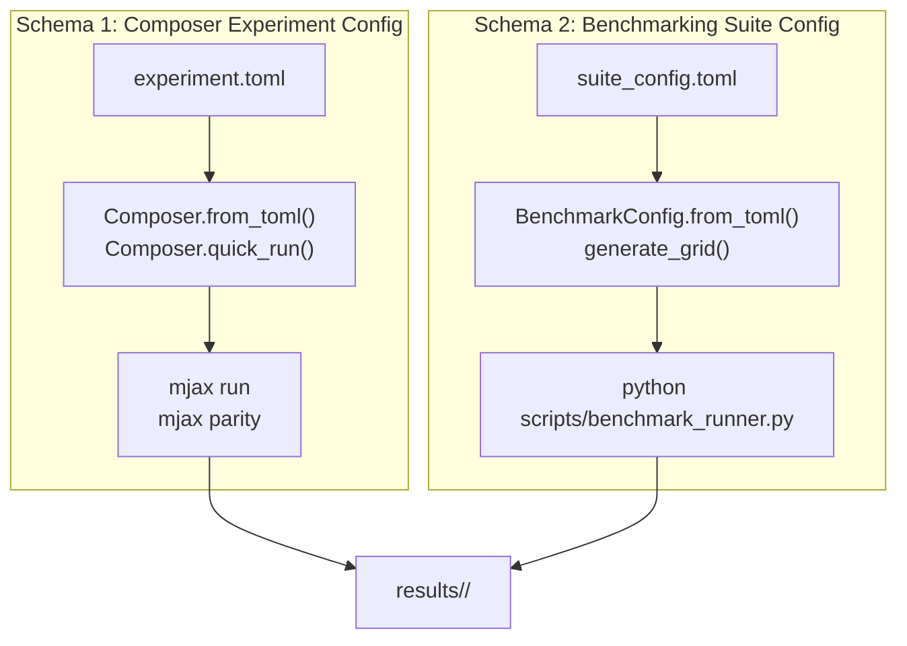

# TOML Configuration & Scaffolding Guide

MalthusJAX uses declarative TOML configurations to manage experiments, benchmark suites, cross-backend comparisons, and automated parameter sweeps. 

This guide explains the dual-architecture configuration system, how inheritance and conflict resolution operate, how to control PRNG algorithms and capture Perfetto execution traces, and how to rapidly scaffold configurations using `scripts/scaffold_toml.py`.

---

## 1. Dual-Architecture Overview

MalthusJAX separates experiment specifications into two specialized schemas:



| Dimension | Schema 1: Composer Experiment TOML | Schema 2: Benchmarking Suite TOML |
| :--- | :--- | :--- |
| **Primary Parser** | `malthusjax.composer.config.load_experiment_config` | `malthusjax.benchmarking.config.BenchmarkConfig.from_toml` |
| **Primary Executor** | `malthusjax.composer.Composer.from_toml` | `scripts/benchmark_runner.py` |
| **CLI Commands** | `mjax run <config>`, `mjax parity <config>` | `python scripts/benchmark_runner.py <config>` |
| **Core Intent** | Single runs, multi-operator ablations, cross-backend comparisons, composable RL | Systematic Cartesian grids & Latin Hypercube Sampling (LHS) sweeps |
| **Root Sections** | `[experiment]`, `[logging]`, `[data]`, `[pipelines]` | `[suite]`, `[grid]`, `[analysis]`, `[pipelines]` |

---

## 2. Composer Experiment Configurations (Schema 1)

### 2.1 The Top-Level `[experiment]` Section

```toml
[experiment]
name = "sphere_comparison"           # Unique experiment name (used for output folders)
output_dir = "results/sphere_study"   # Directory where metadata/, data/, and traces are written
description = "Compare operators on 25D sphere"
seeds = [42, 43, 44]                  # Seeds list or integer count (e.g. 5 -> seeds 1..5)
```

---

### 2.2 Unified Logging: `[logging]`

MalthusJAX includes a zero-overhead host and JIT device logging subsystem:

```toml
[logging]
level = "INFO"               # "DEBUG", "INFO", "WARNING", "ERROR", "CRITICAL"
log_file = "experiment.log"  # Optional file destination (omitted = stderr)
format_type = "color"        # "color" (rich ANSI console) or "json" (structured JSONL)
show_timestamps = false      # Include millisecond ISO timestamps
log_interval = 10            # Trigger JIT host callback every N generations (None = disabled)
log_nan_watchdog = true      # Halt/alert on device-side NaN/Inf detections in fitness
```

> [!TIP]
> When `log_interval` is omitted or set to `None`, **zero callback instructions** are inserted into the compiled XLA graph, guaranteeing 100% maximum execution speed.

---

### 2.3 Shared Defaults & Conflict Resolution (`[experiment.shared]`)

The `[experiment.shared]` section allows you to define baseline parameters once and share them across all pipeline variations.

```toml
[experiment.shared]
fitness = "sphere:dim=25"
pop_size = 64
generations = 200
seeds = [1, 2, 3]
bounds = [-5.0, 5.0]
maximize = false
elitism = 2
selection = "tournament:num_selections=32,tournament_size=3"
mutation = "gaussian:mutation_rate=0.1,mutation_strength=0.1"

# Pipeline 1: Inherits all shared parameters verbatim
[pipelines.uniform]
crossover = "uniform_real"

# Pipeline 2: Overrides pop_size to 256; inherits all other shared parameters
[pipelines.large_pop]
pop_size = 256
crossover = "blend:alpha=0.5"

# Pipeline 3: Completely replaces mutation operator
[pipelines.polynomial]
mutation = "polynomial:mutation_rate=0.05,eta=20"
crossover = "uniform_real"
```

#### Conflict Resolution Mechanics:
1. **Pipeline-Specific Precedence**:
   Values defined in `[pipelines.<name>]` **strictly override** identical keys in `[experiment.shared]`.
2. **Shallow Key Replacement**:
   Merging occurs via Python `{**shared, **pipeline_cfg}`. Sub-tables (like `strategy_params`) completely replace shared sub-tables; they are not recursively merged.
3. **Immutable Coercion**:
   Lists for `bounds` and `seeds` are automatically converted to immutable Python tuples (`(-5.0, 5.0)`) to satisfy JAX PyTree requirements.
4. **Fallback Cascade**:
   If omitted from both sections, `genome_length` is inferred from `fitness = "name:dim=N"` (or defaults to `10`), `maximize` defaults to `false`, `elitism` defaults to `2`, and `backend` defaults to `"malthusjax"`.
5. **Shared Initial Population**:
   By default, `mjax run` and `Composer.from_toml` generate a single random initial population at seed 123 and inject it across all pipelines, ensuring that differences in convergence are purely algorithmic. If a pipeline defines its own `initial_population`, its explicit value takes precedence.

---

### 2.4 Advanced Hardware & Profiling Controls

#### Controlling the PRNG Implementation (`prng_impl`)
Select the underlying pseudo-random number generator depending on hardware and scale:

```toml
[experiment.shared]
prng_impl = "philox4x32"     # Options: "threefry2x32" (default), "philox4x32", "rbg"
```

- **`threefry2x32`**: Standard counter-based JAX PRNG. Strong statistical guarantees.
- **`philox4x32`**: High-throughput parallel PRNG. **Recommended for large GPU runs** (2–3× speedup during heavy parallel mutation).

#### Capturing Perfetto Profiling Traces (`trace_dir`)
Generate execution traces to profile XLA compilation and kernel timelines:

```toml
[experiment.shared]
trace_dir = "results/traces"
```

Inspect traces interactively:
```bash
tensorboard --logdir results/traces --port 6006
```
Or open [ui.perfetto.dev](https://ui.perfetto.dev) and drag-and-drop the generated trace file.

---

### 2.5 Operator String-Specification DSL

MalthusJAX uses a concise string syntax for operator instantiation: `"name:key1=val1,key2=val2"`.

#### Selection Operators:
- `"tournament:num_selections=N,tournament_size=K"`
- `"roulette:num_selections=N"`
- `"elite_pool:num_selections=N,elite_k=K"`
- `"evosax_mimic_selection:num_selections=N,elite_k=K"` (Exact bit-for-bit EvoSAX parity)

#### Crossover Operators:
- Real: `"uniform_real"`, `"blend:alpha=0.5"`, `"simulated_binary:eta=20.0"`, `"binomial:cr=0.8"`, `"batched_evosax_uniform:crossover_rate=0.3"`
- Binary: `"single_point"`, `"uniform_binary"`

#### Mutation Operators:
- Real: `"gaussian:mutation_rate=0.1,mutation_strength=0.1"`, `"ball:radius=0.5"`, `"polynomial:mutation_rate=0.1,eta=20.0"`, `"batched_evosax_gaussian:mutation_strength=0.1"`
- Binary: `"bitflip:mutation_rate=0.05"`, `"swap:mutation_rate=0.1"`, `"scramble:mutation_rate=0.1"`

#### Fitness Functions:
- Continuous: `"sphere:dim=N"`, `"rastrigin:dim=N"`, `"rosenbrock:dim=N"`, `"griewank:dim=N"`, `"bbob:fn=1..24,dims=N"`
- Combinatorial / Binary: `"knapsack:capacity=N,num_items=M"`, `"binary_sum:length=N"`, `"tsp:data_id=ID"`

---

### 2.6 External Framework Adapters

MalthusJAX can orchestrate external evolutionary libraries with zero python overhead:

```toml
# 1. EvoSAX Backend
[pipelines.cma_es]
backend = "evosax"
evosax_strategy = "CMA_ES"   # "SimpleGA", "OpenES", "DifferentialEvolution", "PGPE", "ARS"

[pipelines.cma_es.strategy_params]
sigma_init = 0.5
elite_ratio = 0.5

# 2. QDax Backend (MAP-Elites)
[pipelines.map_elites]
backend = "qdax"
qdax_strategy = "MAPElites"
grid_shape = [50, 50]
bd_extractors = ["identity", "identity"]

# 3. Composable Reinforcement Learning (Brax + Neural MLP)
[pipelines.robot_ant]
backend = "composable_evosax"
strategy = "OpenES"

[pipelines.robot_ant.fitness]
type = "RLEvaluator"
max_steps = 1000

[pipelines.robot_ant.fitness.env]
type = "BraxEnv"
env_name = "ant"

[pipelines.robot_ant.fitness.interpreter]
type = "MLPInterpreter"
hidden = [64, 64]
activation = "swish"
```

---

## 3. Benchmarking Suite Configurations (Schema 2)

Benchmarking suite configurations drive systematic parameter sweeps for academic papers and scalability profiling.

```toml
[suite]
name = "scalability_study"
mode = "lhs"                         # "cartesian" or "lhs"
output_dir = "results/scalability"
num_seeds = 50
aggregation_level = "summary_only"   # "summary_only", "full_trace", "final_only"

# Latin Hypercube Sampling Space-Filling Grid
[grid]
functions = ["sphere", "rosenbrock", "rastrigin", "schwefel"]
dims_min = 10
dims_max = 500
pops_min = 64
pops_max = 2048
gens_min = 50
gens_max = 500
num_samples = 30

[analysis]
reference_pipeline = "malthusjax_fast"
target_metrics = ["best_fitness", "execution_time", "warmup_time"]

# Pipelines with Dynamic Coordinate Interpolation
[pipelines.malthusjax_fast]
backend = "malthusjax"
selection = "evosax_mimic_selection:num_selections={pop_size},elite_k={elite_k}"
crossover = "batched_evosax_uniform:crossover_rate=0.3"
mutation = "batched_evosax_gaussian:mutation_strength=1.0"
elitism = 0
```

### Dynamic Coordinate Placeholders:
- `{pop_size}`: Evaluated population size for the coordinate.
- `{genome_length}`: Evaluated problem dimension $D$.
- `{generations}`: Evaluated generation limit $G$.
- `{elite_k}`: Auto-computed elite size: $\max(2, \lfloor P / 6 \rfloor)$.

---

## 4. Automated TOML Scaffolding CLI (`scripts/scaffold_toml.py`)

MalthusJAX provides an automated scaffolding CLI that generates compliant TOML configurations across 9 specialized recipes.

```bash
python scripts/scaffold_toml.py --recipe <RECIPE> --output <PATH> [OPTIONS]
```

Or via `Makefile`:
```bash
make scaffold-toml ARGS="-r <RECIPE> -o <PATH>"
```

### What Is a `--recipe`?
A recipe is a **parameterized template archetype** representing a concrete scientific experimentation pattern. It automatically configures the appropriate schema, pre-wires inheritance defaults, sets up unified logging, and applies any command-line overrides.

### The 9 Available Recipes:

```bash
make scaffold-toml ARGS="--list-recipes"
```

| Recipe Key | Schema | Description & Intent |
| :--- | :--- | :--- |
| `single_run` | `COMPOSER` | Single-pipeline experiment with pre-configured unified logging. |
| `ablation` | `COMPOSER` | Multi-operator ablation (Uniform vs. BLX-$\alpha$ vs. SBX) on a shared objective. |
| `parity` | `COMPOSER` | Statistical parity test between MalthusJAX and EvoSAX SimpleGA. |
| `backend_comparison`| `COMPOSER` | Cross-framework comparison (MalthusJAX vs. CMA-ES vs. OpenES). |
| `quality_diversity` | `COMPOSER` | MAP-Elites quality-diversity archive study. |
| `composable_rl` | `COMPOSER` | Composable RL pipeline wrapping Brax environments and MLP neural network interpreters. |
| `data_registry` | `COMPOSER` | Combinatorial optimization (TSP / Knapsack) with decoupled `[data.*]` registries. |
| `benchmark_cartesian`| `SUITE` | High-throughput Cartesian grid sweep suite. |
| `benchmark_lhs` | `SUITE` | Latin Hypercube Sampling (LHS) space-filling scalability study. |

### CLI Options:
- `-r`, `--recipe`: Recipe name (default: `single_run`).
- `-o`, `--output`: Output filepath (required).
- `-n`, `--name`: Experiment/suite name (defaults to file stem).
- `-f`, `--fitness`: Fitness spec (default: `"sphere:dim=20"`).
- `-p`, `--pop-size`: Population size override (default: `64`).
- `-g`, `--generations`: Generation limit override (default: `100`).
- `-s`, `--seeds`: Seed count or list (e.g. `10` or `"[1, 2, 3]"`).
- `--no-logging`: Omit the `[logging]` section.

### Scaffolding Examples:

```bash
# 1. Quick single run with logging:
python scripts/scaffold_toml.py -r single_run -o configs/test_sphere.toml

# 2. Operator ablation on Rastrigin 30D:
python scripts/scaffold_toml.py -r ablation -o configs/ablation_rastrigin.toml -f "rastrigin:dim=30"

# 3. Cluster LHS scaling study:
python scripts/scaffold_toml.py -r benchmark_lhs -o configs/cluster_lhs.toml -n cluster_scaling -s 50
```

---

## 5. Execution Reference

Once scaffolded, execute your configuration with standard MalthusJAX tools:

```bash
# Execute Composer experiment (Schema 1):
mjax run configs/my_experiment.toml

# Execute statistical parity comparison:
mjax parity configs/parity_test.toml

# Execute benchmarking sweep suite (Schema 2):
python scripts/benchmark_runner.py configs/cluster_lhs.toml

# Run quick 2-coordinate smoke test of a suite:
python scripts/benchmark_runner.py configs/cluster_lhs.toml --smoke
```
